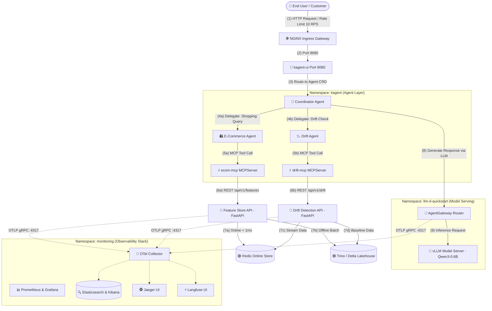

# 🛍️ E-Commerce Kubernetes-native AI Agent & MLOps System

Dự án xây dựng hệ thống AI Agent Kubernetes-native hoàn chỉnh, tích hợp Real-time Feature Store, Data Drift Monitoring, Model Serving gateway, và cơ chế tự động co giãn (Autoscaling) đáp ứng tải cao trên cụm Kubernetes.

---

## 📑 Danh Mục Tài Liệu & Hướng Dẫn

### 🚀 Hướng Dẫn Vận Hành Hệ Thống:
* **[HƯỚNG DẪN TRIỂN KHAI TOÀN DIỆN TRÊN KUBERNETES (HUONG_DAN_CHAY.md)](./HUONG_DAN_CHAY.md):** Cung cấp quy trình 5 giai đoạn từ thiết lập hạ tầng (IaC), build ảnh Docker, deploy cụm Kubernetes, tích hợp KEDA, Ingress, Observability đến kiểm tra vận hành hệ thống.

### 📋 12 Báo Cáo Kỹ Thuật Chi Tiết (Thư mục `docs/`):
1. **[Kiến Trúc LLM Agent — KAgent/KMCP/llm-d (`docs/llm_agent_architecture.md`)](./docs/llm_agent_architecture.md):** Kiến trúc AI Agent System theo chuẩn Kubernetes-native: KAgent CRDs, KMCP MCPServer, llm-d Inference Platform và AgentRegistry.
2. **[LLM Inference Platform & Benchmarks (`docs/llm_inference_platform.md`)](./docs/llm_inference_platform.md):** Hướng dẫn setup Custom Model Server, tối ưu hóa KV Cache & Speculative Decoding, cấu hình AgentGateway routing và kết quả benchmark.
3. **[AgentRegistry & Security Sandboxing (`docs/agent_registry.md`)](./docs/agent_registry.md):** Triển khai AgentRegistry Helm chart, thiết lập phân quyền tối thiểu SecurityContext Sandbox cho Agent, chạy Agent dưới dạng Multi-replica.
4. **[Định Tuyến Gateway & Rate Limit (`docs/ingress_gateway.md`)](./docs/ingress_gateway.md):** Thiết lập Ingress Gateway, Rate Limit 10 RPS, và KEDA ScaledObject.
5. **[Logging & Tracing — ECK + Jaeger (`docs/logging_tracing.md`)](./docs/logging_tracing.md):** Triển khai ECK Stack (Elasticsearch + Kibana) cho centralized logging và Jaeger + OpenTelemetry cho distributed tracing.
6. **[Giám Sát Hệ Thống Grafana & Langfuse (`docs/observability.md`)](./docs/observability.md):** Hệ thống dashboard đo lường Web API, phần cứng, LLM và Langfuse LLMOps.
7. **[Báo Cáo CI/CD Pipelines (`docs/cicd.md`)](./docs/cicd.md):** Lịch sử chạy thành công của Jenkins Declarative Pipeline (5 Stages), Docker Hub Images, và GitHub Semantic Tag.
8. **[Báo Cáo Kiểm Thử Tự Động (`docs/Testing.md`)](./docs/Testing.md):** Báo cáo chi tiết về 36 Pytest test cases, độ phủ Coverage (>90%), Boundary value analysis và Hypothesis property testing.
9. **[Mẫu Thiết Kế Phần Mềm Sử Dụng (`docs/design_patterns.md`)](./docs/design_patterns.md):** Ứng dụng Strategy Pattern (Drift), Adapter Pattern (FeatureStore) và 5 Key Classes trong mã nguồn dự án.
10. **[Bảo Mật & Quản Lý Mã Bí Mật (`docs/security_secrets.md`)](./docs/security_secrets.md):** Quản lý mã bí mật tập trung bằng Kubernetes Secrets và RBAC.
11. **[Agent Warm Up & Cold Start Optimization (`docs/warmup_benchmark.md`)](./docs/warmup_benchmark.md):** Cấu hình Warm Up initContainer và KEDA warm pool strategy.
12. **[Báo Cáo Triển Khai IaC (`docs/iac_ansible_terraform.md`)](./docs/iac_ansible_terraform.md):** Quy trình cấp phát tự động cụm GKE bằng Terraform và cấu hình VM bằng Ansible.

---

## 1. Công Nghệ Sử Dụng & Vai Trò (Technology Stack & Roles)

| Thành Phần | Công Nghệ | Vai Trò |
| :--- | :--- | :--- |
| **Agent Framework** | KAgent (`kagent.dev`) | Kubernetes Operator và Custom Resource Definitions (CRDs) để khai báo và quản lý AI Agents (`Agent`, `ModelConfig`, `MCPServer`). |
| **MCP Tool Server** | KMCP + FastMCP | Triển khai các MCP Servers theo chuẩn Model Context Protocol để cung cấp công cụ (Tools) cho Agent gọi qua giao thức HTTP. |
| **Model Serving Platform** | llm-d (vLLM + AgentGateway) | Hệ thống phục vụ mô hình ngôn ngữ lớn (Qwen3-0.6B) tối ưu hóa GPU/CPU trên cụm Kubernetes. |
| **Agent Catalog** | AgentRegistry (`aregistry.ai`) | Đăng ký, quản lý vòng đời và catalog của các Agent và Tools. |
| **Autoscaling Engine** | KEDA | Event-driven Autoscaler tự động điều chỉnh số lượng Pods từ 1 đến 5 dựa trên CPU. |
| **Edge Gateway** | NGINX Ingress Controller | Cổng kiểm soát lưu lượng, định tuyến và Rate Limiting (10 RPS). |
| **CI/CD Pipeline** | Jenkins Declarative Pipeline | Tự động hóa quá trình chạy 36 tests, build 4 Docker images, đẩy lên Docker Hub và deploy Zero-Downtime lên GKE. |
| **Observability** | OTel, Jaeger, ECK, Grafana, Langfuse | Giám sát toàn diện Traces, Metrics, Logs và LLMOps Tracing. |

---

## 2. Kiến Trúc AI Agent System

---

## 3. Các MCP Servers & Agents

### 3.1. Danh Sách MCP Servers

| MCP Server | Thư mục | MCP Tools | Backend Web API Gọi Tới |
| :--- | :--- | :--- | :--- |
| **ecom-mcp** | [agentic_ai/ecom-mcp/](file:///home/nhan/Projects/final_coursework/final_llm_agent/agentic_ai/ecom-mcp) | `get_customer_shopping_context`, `get_trending_products_analytics` | `http://feature-api-service.default.svc:8000` |
| **drift-mcp** | [agentic_ai/drift-mcp/](file:///home/nhan/Projects/final_coursework/final_llm_agent/agentic_ai/drift-mcp) | `detect_feature_drift` | `http://drift-api-service.default.svc:8003` |

### 3.2. Danh Sách AI Agents

| Agent | Thư mục Manifest | MCP Servers Sử Dụng | Vai Trò |
| :--- | :--- | :--- | :--- |
| **ecom-agent** | [agentic_ai/ecom-mcp/deployments/](file:///home/nhan/Projects/final_coursework/final_llm_agent/agentic_ai/ecom-mcp/deployments) | `ecom-mcp` | Tư vấn mua sắm cá nhân hóa cho khách hàng dựa trên Feature Store. |
| **drift-agent** | [agentic_ai/drift-mcp/deployments/](file:///home/nhan/Projects/final_coursework/final_llm_agent/agentic_ai/drift-mcp/deployments) | `drift-mcp` | Giám sát và phát hiện hiện tượng trôi lệch dữ liệu thời gian thực. |
| **coordinator-agent** | [agentic_ai/coordinator-agent/deployments/](file:///home/nhan/Projects/final_coursework/final_llm_agent/agentic_ai/coordinator-agent/deployments) | `ecom-mcp`, `drift-mcp` | Master Coordinator điều phối tác vụ và kích hoạt công cụ từ cả 2 MCP Servers. |
