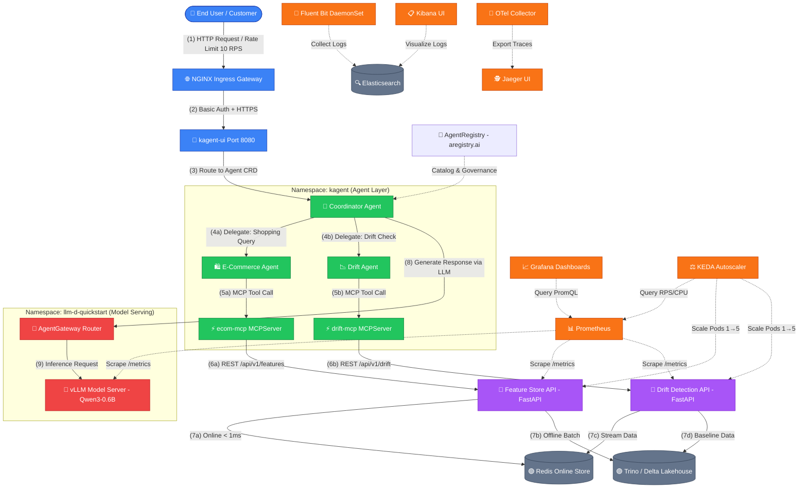

# E-commerce Kubernetes-native AI Agent & MLOps System (Final Coursework)

Dự án xây dựng hệ thống AI Agent Kubernetes-native hoàn chỉnh, tích hợp Real-time Feature Store, Data Drift Monitoring, Model Serving gateway, và cơ chế tự động co giãn (Autoscaling) đáp ứng tải cao trên cụm Kubernetes.

---

## 📑 Danh Mục Tài Liệu & Hướng Dẫn

### 🚀 Hướng Dẫn Chạy & Triển Khai Hệ Thống:
* **[HƯỚNG DẪN TRIỂN KHAI TOÀN DIỆN TRÊN KUBERNETES (HUONG_DAN_CHAY.md)](./HUONG_DAN_CHAY.md):** Cung cấp quy trình 11 bước từ thiết lập hạ tầng (IaC), build ảnh Docker, deploy cụm Kubernetes, tích hợp KEDA, Ingress, Observability đến kiểm tra vận hành hệ thống.

### 📋 Báo Cáo Kỹ Thuật Chi Tiết (Thư mục `docs/`):
1. **[Kiến Trúc LLM Agent — KAgent/KMCP/llm-d (`docs/llm_agent_architecture.md`)](./docs/llm_agent_architecture.md):** Kiến trúc AI Agent System theo chuẩn Kubernetes-native: KAgent CRDs, KMCP MCPServer, llm-d Inference Platform và AgentRegistry.
2. **[LLM Inference Platform & Benchmarks (`docs/llm_inference_platform.md`)](./docs/llm_inference_platform.md):** Hướng dẫn setup Custom Model Server, tối ưu hóa KV Cache & Speculative Decoding, cấu hình AgentGateway routing, tăng HA cho worker pool, và kết quả benchmark Locust.
3. **[AgentRegistry & Security Sandboxing (`docs/agent_registry.md`)](./docs/agent_registry.md):** Triển khai AgentRegistry Helm chart, thiết lập phân quyền tối thiểu SecurityContext Sandbox cho Agent, chạy Agent dưới dạng Multi-replica, và kiểm tra qua UI Chat.
4. **[Thiết Kế Schema & SCD Type 2 (`docs/schema_design.md`)](./docs/schema_design.md):** Giải trình mô hình Star Schema, OBT, quy ước đặt tên bảng và cơ chế SCD Type 2 / Point-in-Time Join.
5. **[Báo Cáo Tối Ưu Hóa Dữ Liệu & Storage (`docs/data_optimization.md`)](./docs/data_optimization.md):** Báo cáo chi tiết kỹ thuật Salting (Data Skew), Broadcast Join, `approx_count_distinct` (High Cardinality), Flink Watermark 45m & Deduplication, và Delta Compaction & Z-Ordering.
6. **[Báo Cáo Kiểm Thử Tự Động & Locust Load Test (`docs/Testing.md`)](./docs/Testing.md):** Báo cáo chi tiết về Unit test coverage (>90%), phân tích giá trị biên, Mutation testing (mutmut), Property-based testing (Hypothesis), và kết quả Locust.
7. **[Quản Trị Dữ Liệu & Airflow Lineage (`docs/data_governance.md`)](./docs/data_governance.md):** Sơ đồ Data Lineage và Assertions kiểm định chất lượng trên DataHub cho RAG data pipeline.
8. **[Mô Phỏng Sinh Dữ Liệu & Drift (`docs/data_generation.md`)](./docs/data_generation.md):** Cấu hình generator và kết quả ghép nối bảng nhãn (id & label).
9. **[Báo Cáo CI/CD Pipelines (`docs/cicd.md`)](./docs/cicd.md):** Lịch sử chạy thành công của GitHub Actions và Jenkins pipelines.
10. **[Định Tuyến Gateway & Rate Limit (`docs/ingress_gateway.md`)](./docs/ingress_gateway.md):** Thiết lập Ingress Gateway, Basic Auth, Rate Limit 10 RPS, HTTPS/SSL và UI access.
11. **[Báo Cáo Triển Khai IaC (`docs/iac_ansible_terraform.md`)](./docs/iac_ansible_terraform.md):** Quy trình cấp phát tự động cụm GKE bằng Terraform và cấu hình VM bằng Ansible.
12. **[Giám Sát Hệ Thống Grafana (`docs/observability.md`)](./docs/observability.md):** Hệ thống dashboard đo lường Web API, phần cứng, LLM và Agent.
14. **[Bảo Mật & Quản Lý Mã Bí Mật (`docs/security_secrets.md`)](./docs/security_secrets.md):** Quản lý mã bí mật tập trung bằng HashiCorp Vault / Kubernetes Secrets.
15. **[Mẫu Thiết Kế Phần Mềm Sử Dụng (`docs/design_patterns.md`)](./docs/design_patterns.md):** Ứng dụng Strategy Pattern và Adapter Pattern trong mã nguồn dự án.
16. **[Báo Cáo Kiểm Thử Tải Locust (`docs/locust_report.html`)](./docs/locust_report.html):** File báo cáo HTML kết quả kiểm thử tải Locust gốc.
17. **[Logging & Tracing — EFK + Jaeger (`docs/logging_tracing.md`)](./docs/logging_tracing.md):** Triển khai EFK Stack (Elasticsearch + Fluent Bit + Kibana) cho centralized logging và Jaeger + OpenTelemetry cho distributed tracing.
18. **[Agent Warm Up & Cold Start Optimization (`docs/warmup_benchmark.md`)](./docs/warmup_benchmark.md):** Cấu hình Warm Up pool, benchmark trước/sau tối ưu cold start, và KEDA idle replicas strategy.

### 🧪 Jupyter Notebooks Demo (Thư mục `notebooks/`):
* **[Agent Demo Notebook (`notebooks/agent_demo.ipynb`)](./notebooks/agent_demo.ipynb):** Jupyter notebook minh chứng Agent tương tác trực tiếp với MCP Servers — kéo feature từ Feature Store, drift detection, và RAG context retrieval.

---

## 1. Công Nghệ Sử Dụng & Vai Trò (Technology Stack & Roles)

| Thành Phần | Công Nghệ | Vai Trò |
| :--- | :--- | :--- |
| **Agent Framework** | KAgent (`kagent.dev`) | Kubernetes Operator và Custom Resource Definitions (CRDs) để khai báo và quản lý AI Agents (Agent, ModelConfig, MCPServer). |
| **MCP Tool Server** | KMCP + FastMCP | Triển khai các MCP Servers theo chuẩn Model Context Protocol để cung cấp công cụ (Tools) cho Agent gọi qua giao thức HTTP/SSE. |
| **Model Serving Platform** | llm-d (vLLM + AgentGateway) | Hệ thống phục vụ mô hình ngôn ngữ lớn (Qwen3-0.6B) tối ưu hóa GPU trên cụm Kubernetes. |
| **Agent Catalog** | AgentRegistry (`aregistry.ai`) | Đăng ký, quản lý vòng đời và lưu trữ đặc tả (Specs) của các Agent. |
| **Autoscaling Engine** | KEDA | Event-driven Autoscaler tự động điều chỉnh số lượng Pods dựa trên tải CPU hoặc Request Rate từ Prometheus. |
| **Edge Gateway** | NGINX Ingress Gateway | Cổng kiểm soát lưu lượng, định tuyến, tích hợp CORS và Rate Limiting (10 RPS). |
| **CI/CD Pipeline** | GitHub Actions & Jenkins | Tự động hóa quá trình chạy tests, build Docker images, đẩy lên Registry, và cập nhật zero-downtime lên GKE. |

---

## 2. Kiến Trúc AI Agent System

Hệ thống được tổ chức hoàn toàn dưới dạng Cloud-Native:

**Chú thích luồng dữ liệu (Flow Legend):**

| Loại Luồng | Kiểu Nét | Mô Tả |
|:---|:---|:---|
| 🔵 **User Request Flow** | Nét liền (`-->`) | Luồng yêu cầu từ người dùng → Gateway → Agent |
| 🟢 **Agent Orchestration** | Nét liền (`-->`) | Luồng điều phối Agent → MCP Tools |
| 🟣 **Data Flow** | Nét liền (`-->`) | Luồng truy xuất dữ liệu API → Redis/Trino |
| 🔴 **LLM Inference** | Nét liền (`-->`) | Luồng sinh phản hồi qua Model Server |
| 🟠 **Monitoring (Observability)** | Nét đứt (`-.->`) | Luồng thu thập metrics/logs/traces |
| ⬜ **Storage** | Nét đứt (`-.->`) | Kho lưu trữ dữ liệu |

---

## 3. Các MCP Servers & Agents

### 3.1. Danh Sách MCP Servers

| MCP Server | Thư mục | MCP Tools | Backend Web API Gọi Tới |
| :--- | :--- | :--- | :--- |
| **ecom-mcp** | `ecom-mcp/` | `get_customer_shopping_context`, `get_trending_products_analytics` | `http://feature-api-service.default.svc:8000` |
| **drift-mcp** | `drift-mcp/` | `detect_feature_drift` | `http://drift-api-service.default.svc:8003` |

### 3.2. Danh Sách AI Agents

| Agent | Thư mục Manifest | MCP Servers Sử Dụng | Vai Trò |
| :--- | :--- | :--- | :--- |
| **ecom-agent** | `ecom-mcp/deployments/` | ecom-mcp | Tư vấn mua sắm cá nhân hóa cho khách hàng dựa trên Feature Store. |
| **drift-agent** | `drift-mcp/deployments/` | drift-mcp | Giám sát và phát hiện hiện tượng trôi lệch dữ liệu thời gian thực. |
| **coordinator-agent** | `coordinator-agent/deployments/` | ecom-mcp, drift-mcp | Đại diện trung tâm điều phối và kích hoạt công cụ từ cả 2 MCP Servers. |
