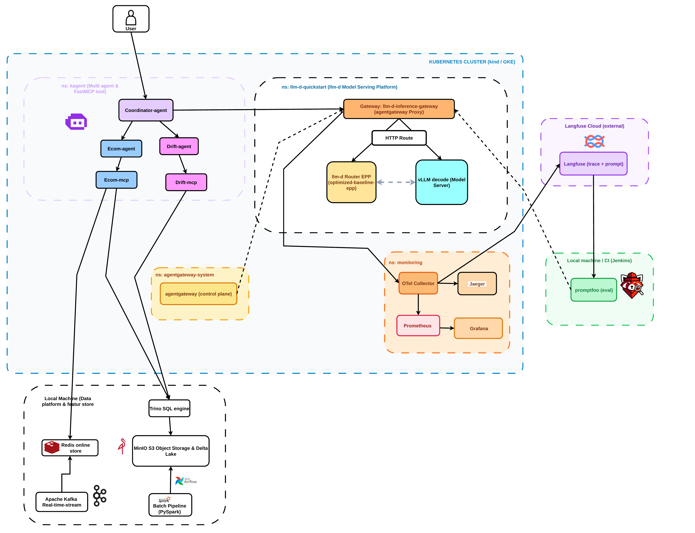

# 🛍️ E-Commerce Kubernetes-native Multi-Agent AI & MLOps System

Dự án xây dựng hệ thống **Multi-Agent AI chuẩn Kubernetes-native**, tích hợp **Real-time Feature Store**, **Lakehouse Data Pipeline**, **llm-d Model Serving Platform** (với Envoy AgentGateway, KV-cache EPP routing và vLLM engine), **Full-Stack Observability** (OpenTelemetry, Jaeger, Prometheus, Grafana, Langfuse Cloud), cùng **Prompt Quality Gate (CI/CD)** đáp ứng tiêu chuẩn vận hành sản xuất (Production-Ready).

---

## 📑 Mục Lục
1. [Tổng Quan Công Nghệ & Vai Trò Hệ Thống](#1-tổng-quan-công-nghệ--vai-trò-hệ-thống)
2. [Kiến Trúc & Luồng Vận Hành Hệ Thống (Master Architecture Workflow)](#2-kiến-trúc--luồng-vận-hành-hệ-thống-master-architecture-workflow)
3. [Danh Sách Multi-Agent & FastMCP Tool Servers](#3-danh-sách-multi-agent--fastmcp-tool-servers)
4. [Hướng Dẫn Khởi Chạy Hệ Thống Từ A-Z (Quickstart Guide)](#4-hướng-dẫn-khởi-chạy-hệ-thống-từ-a-z-quickstart-guide)
5. [Kiểm Thử Chất Lượng & Truy Cập Các Giao Diện Giám Sát](#5-kiểm-thử-chất-lượng--truy-cập-các-giao-diện-giám-sát)
6. [Danh Mục 8 Báo Cáo Kỹ Thuật Chuyên Sâu](#6-danh-mục-8-báo-cáo-kỹ-thuật-chuyên-sâu-technical-deep-dive-reports)

---

## 1. Tổng Quan Công Nghệ & Vai Trò Hệ Thống

| Thành Phần | Công Nghệ Sử Dụng | Vai Trò Trong Hệ Thống |
| :--- | :--- | :--- |
| **Agent Framework** | **KAgent** (`kagent.dev`) | Kubernetes Operator quản lý vòng đời AI Agents bằng Custom Resource Definitions (CRDs: `Agent`, `ModelConfig`, `MCPServer`). |
| **MCP Tool Servers** | **FastMCP** (Python 3.11) | Triển khai các công cụ tra cứu dữ liệu (`search_ecommerce_data`, `check_data_drift`) theo chuẩn Model Context Protocol qua HTTP Stream :8000. |
| **Model Serving Platform** | **llm-d** (Proxy + EPP + vLLM) | Nền tảng phục vụ mô hình ngôn ngữ lớn (Qwen2.5-Coder-0.5B) với PagedAttention v2, hỗ trợ chuẩn Gateway API Inference Extension (GAIE). |
| **AI Gateway** | **Envoy AgentGateway** | Cổng Gateway chuẩn K8s Gateway API v1 quản lý định tuyến, Dynamic Prompt Caching, Token Metering và GenAI Semantic Tracing (:80 / NodePort :32257). |
| **Endpoint Picker (EPP)** | **llm-d Router EPP** | Pod `optimized-baseline-epp` điều phối request dựa trên KV-cache affinity và trạng thái tải hàng đợi của vLLM Pods qua gRPC `ext-proc`. |
| **Online Feature Store** | **Redis Online Store** | Lưu trữ hồ sơ khách hàng và tính năng luồng thời gian thực với độ trễ `< 1ms` (`feat_stream:*` - views, cart, live behavior). |
| **Distributed SQL Engine** | **Trino SQL Engine** | Truy vấn phân tán SQL trên định dạng Delta Lake Parquet (:8085) phục vụ tra cứu lịch sử 90 ngày và mẫu chuẩn kiểm định trôi lệch. |
| **Lakehouse Object Storage** | **MinIO S3 & Delta Lake** | Kho lưu trữ đối tượng chuẩn S3 (:9000/:9001) lưu trữ bảng dữ liệu phân tầng Bronze ➔ Silver ➔ Gold (`feat_customer_unified`). |
| **Streaming & Batch ETL** | **Apache Kafka & Airflow** | Kafka (:9092) thu thập CDC clickstream thời gian thực; Airflow & PySpark (:8081) chạy pipeline tổng hợp dữ liệu lịch sử định kỳ. |
| **Observability Hub** | **OTel Collector, Jaeger, Prometheus, Grafana** | Gom toàn bộ Spans và Metrics qua OTLP gRPC (:4317), hiển thị Distributed Tracing (:16686), lưu trữ chỉ số (:9090) và vẽ Dashboards (:3000). |
| **Cloud LLMOps Tracing** | **Langfuse Cloud** | Quản lý cây Trace phân cấp (LLM Generation + Tool Spans) và lưu trữ Prompt phiên bản Production (`cloud.langfuse.com`). |
| **Prompt Quality Gate** | **Promptfoo** | Kiểm thử tự động (Cosine similarity & JSON schema validation) đối chuẩn qua Gateway NodePort (:32257) trước khi triển khai. |
| **CI/CD Pipeline** | **Jenkins Pipeline** | Tự động hóa kiểm thử mã nguồn Pytest, kiểm tra chất lượng Promptfoo, Semantic Tagging và triển khai cập nhật lên cụm K8s. |

---

## 2. Kiến Trúc & Luồng Vận Hành Hệ Thống (Master Architecture Workflow)

Sơ đồ kiến trúc tổng thể thể hiện rõ ranh giới giữa **Tầng Ứng Dụng AI & Phục Vụ Mô Hình (trên Kubernetes Cluster)**, **Tầng Nền Tảng Dữ Liệu Hồ/Kho (Local Machine Data Platform)** và **Tầng Đảm Bảo Chất Lượng & Giám Sát Đám Mây (Langfuse Cloud & Jenkins)**:

<p align="center">
  
</p>

> 📄 **Tải bản vẽ vector PDF chất lượng cao (phục vụ in ấn/bảo vệ đồ án):** [master_architecture_workflow.pdf](./docs/master_architecture_workflow.pdf)

---

### 📋 Thuyết Minh 14 Bước Vận Hành Hệ Thống Toàn Diện:

1. **(1) Yêu Cầu Từ Người Dùng (User Request):**  
   Người dùng gửi câu hỏi từ trình duyệt Web UI (`kagent-ui` cổng `:8080`) tới **`coordinator-agent`**.
2. **(2) Phân Tích Ý Định & Phân Việc (Task Delegation):**  
   `coordinator-agent` phân tích nội dung câu hỏi để định tuyến tác vụ chuyên biệt:
   * **(2a) Shopping Intent:** Yêu cầu tra cứu sản phẩm, giỏ hàng hoặc chính sách ➔ chuyển cho **`ecom-agent`**.
   * **(2b) Drift Intent:** Yêu cầu kiểm tra phân phối, trôi lệch dữ liệu thời gian thực ➔ chuyển cho **`drift-agent`**.
3. **(3) Gọi Công Cụ Phân Tán (FastMCP Tool Call):**  
   * `ecom-agent` gọi tool `search_ecommerce_data` trên Pod **`ecom-mcp`** (:8000).
   * `drift-agent` gọi tool `check_data_drift` trên Pod **`drift-mcp`** (:8000).
4. **(4) Suy Luận Mô Hình Qua ModelConfig (Shared ModelConfig Hub):**  
   Cả 3 Agent đều trỏ chung vào CRD **`llm-d-model-config`** để gửi Prompts kèm Tool Schema sang **Gateway: `llm-d-inference-gateway`** (đóng vai trò `agentgateway Proxy` cổng `:80`).
5. **(5) Tham Vấn Tối Ưu Hóa Bộ Nhớ Đệm (EPP Advisory):**  
   Gateway tra cứu `HTTPRoute`, gửi yêu cầu `ext-proc` qua gRPC tới **`llm-d Router EPP`** (`optimized-baseline-epp`) để tham vấn chọn Pod vLLM tối ưu theo bộ nhớ đệm KV-cache affinity và tải hàng đợi.
6. **(6) Phục Vụ Suy Luận vLLM (Inference Forwarding):**  
   Gateway chuyển tiếp request trực tiếp tới Pod **`vLLM decode`** (`optimized-baseline-cpu-vllm-decode` chạy Qwen2.5-Coder-0.5B) với engine PagedAttention v2 để sinh token. *(Đường nét đứt giữa EPP và vLLM là probe kiểm tra trạng thái bộ nhớ đệm, không truyền dữ liệu inference).*
7. **(7) Cấu Hình Định Tuyến Động (Dynamic xDS Policy):**  
   `agentgateway (control plane)` trong `ns: agentgateway-system` tự động đồng bộ HTTPRoute và chính sách OpenTelemetry Tracing sang Gateway Proxy.
8. **(8) Tương Tác Hồ Dữ Liệu & Feature Store (Data Platform Lakehouse):**  
   Hai MCP Tool Servers kết nối qua cầu nối mạng ra ngoài Local Machine để đọc/ghi dữ liệu:
   * **(8a)** `ecom-mcp` đọc tính năng giỏ hàng và lượt xem 30 phút gần nhất từ **Redis Online Store** (:6379, độ trễ `< 1ms`, key `feat_stream:*`).
   * **(8b)** `ecom-mcp` truy vấn lịch sử 90 ngày đơn hàng qua **Trino SQL** (:8085) trên bảng Delta Lake Gold.
   * **(8c)** `drift-mcp` quét phân phối cửa sổ dòng dữ liệu hiện tại từ **Redis**.
   * **(8d)** `drift-mcp` truy vấn 500 mẫu dữ liệu chuẩn lịch sử từ **Trino SQL** để tính toán kiểm định KS-test và chỉ số trôi lệch PSI.
   * **Nội bộ Data Platform:** **Kafka** (:9092) nhận luồng sự kiện đẩy vào Redis và MinIO Bronze; **Airflow & PySpark** (:8081) chạy ETL định kỳ tổng hợp dữ liệu Gold Parquet trên **MinIO S3**; **Trino** đọc trực tiếp Delta Parquet từ MinIO.
9. **(9) Thu Thập Dữ Liệu Đo Lường Tập Trung (Telemetry Central Hub):**  
   Gateway (LLM tokens, latency) và 2 FastMCP Pods (Tool Spans) đẩy toàn bộ dữ liệu đo lường OTLP gRPC (:4317) về **`OTel Collector`**.
10. **(10) Lưu Trữ Trace Phân Tán Nội Bộ (Local Traces):**  
    `OTel Collector` nhân bản trace qua pipeline `otlp/jaeger` chuyển vào **Jaeger UI** (:16686) để xem vết tương tác giữa các Pod trong K8s.
11. **(11) Xuất Trace LLMOps Lên Đám Mây (Cloud Observability):**  
    `OTel Collector` xuất trace qua OTLP/HTTP lên **Langfuse Cloud** hiển thị trực quan cây thực thi phân cấp gồm LLM Generation Spans và Tool Spans (icon 🔧).
12. **(12) Đồng Bộ Prompt Phiên Bản Sản Xuất (Prompt Management):**  
    Bộ công cụ kiểm chuẩn **`promptfoo`** tự động kéo Prompt phiên bản `production` mới nhất từ Langfuse Cloud.
13. **(13) Kiểm Thử Chất Lượng Tự Động (Prompt Quality Gate):**  
    `promptfoo` thực thi bộ test suite tự động kiểm tra độ tương đồng ngữ nghĩa (Cosine similarity) và định dạng JSON schema đối chuẩn trực tiếp qua Gateway NodePort (:32257).
14. **(14) Cơ Sở Dữ Liệu Chỉ Số & Trực Quan Hóa (Metrics & Dashboards):**  
    * **(14a)** `OTel Collector` đẩy metric đo lường qua `otlphttp/prometheus` vào **Prometheus Server** (:9090).
    * **(14b)** **Grafana Dashboards** (:3000 / :8082) kết nối vào Prometheus Datasource bằng ngôn ngữ PromQL để vẽ biểu đồ tài nguyên máy, dung lượng ổ đĩa, throughput và thời gian đáp ứng mô hình.

---

## 3. Danh Sách Multi-Agent & FastMCP Tool Servers

### 3.1. Các FastMCP Tool Servers
| MCP Server | Thư Mục Mã Nguồn | Công Cụ (MCP Tools) | Giao Thức / Cổng |
| :--- | :--- | :--- | :--- |
| **`ecom-mcp`** | `agentic_ai/ecom-mcp/` | `search_ecommerce_data` (Lấy hồ sơ streaming Redis & lịch sử đơn hàng Trino) | HTTP Stream `:8000/mcp` |
| **`drift-mcp`** | `agentic_ai/drift-mcp/` | `check_data_drift` (Tính toán kiểm định KS-Test & PSI phát hiện lệch phân phối) | HTTP Stream `:8000/mcp` |

### 3.2. Các AI Agents (CRD: `kagent.dev/v1alpha2`)
| Agent | Manifest Deployment | ModelConfig Sử Dụng | Vai Trò & Nghiệp Vụ |
| :--- | :--- | :--- | :--- |
| **`coordinator-agent`** | `agentic_ai/coordinator-agent/deployments/` | `llm-d-model-config` | Phân tích ý định người dùng (Supervisor Pattern), điều phối gọi `ecom-agent` hoặc `drift-agent`. |
| **`ecom-agent`** | `agentic_ai/ecom-mcp/deployments/` | `llm-d-model-config` | Tư vấn sản phẩm, quản lý giỏ hàng, thông tin chính sách bảo hành dựa trên hồ sơ khách hàng. |
| **`drift-agent`** | `agentic_ai/drift-mcp/deployments/` | `llm-d-model-config` | Phân tích hiện tượng trôi lệch phân phối tính năng so với mẫu chuẩn lịch sử, đưa ra cảnh báo drift. |

---

## 4. Hướng Dẫn Khởi Chạy Hệ Thống Từ A-Z (Quickstart Guide)

Dưới đây là quy trình 6 bước cụ thể để khởi chạy toàn bộ hệ thống từ khi chưa có gì trên môi trường máy chủ Linux / Ubuntu.

### 4.1. Yêu Cầu Môi Trường (Prerequisites)
* **Hệ điều hành:** Linux (Ubuntu 22.04+ khuyên dùng).
* **Công cụ cài sẵn:** `docker`, `docker compose`, `kind` (v0.20+), `kubectl`, `helm` (v3+), `python3` (3.10+).

---

### Bước 1: Khởi Động Tầng Dữ Liệu Lakehouse (Docker Compose)
Toàn bộ Data Stack được khởi chạy trên Docker Engine của máy chủ Host:

```bash
cd /home/nhan/Projects/final_coursework/minicoursework

# 1. Tạo Docker network chia sẻ
docker network create datahub_network 2>/dev/null || true

# 2. Khởi chạy toàn bộ Data Stack
docker compose -f docker-compose.yml up -d

# 3. Sinh dữ liệu mẫu vào MinIO Gold Delta Lake và Redis Feature Store
python3 data_generation/main.py
python3 data_generation/generate_rag_documents.py
python3 data_generation/generate_stream_features.py
```
*Dữ liệu mẫu (`CUST_000001`) và tính năng luồng `feat_stream:*` đã sẵn sàng trên Redis (:6379) và MinIO (:9000).*

---

### Bước 2: Khởi Tạo Cụm Kubernetes Kind & Tạo Cầu Nối Mạng
Chuyển về thư mục dự án `final_llm_agent`:

```bash
cd /home/nhan/Projects/final_coursework/final_llm_agent

# 1. Tạo cụm Kubernetes Kind cục bộ
kind create cluster --name agentic-ai --config agentic_ai/kind-config.yaml

# 2. Nạp Docker Images của 2 FastMCP Servers vào cụm Kind
docker build -t nhannguyen2201/ecom-mcp:0.0.1 agentic_ai/ecom-mcp
docker build -t nhannguyen2201/drift-mcp:0.0.1 agentic_ai/drift-mcp
kind load docker-image nhannguyen2201/ecom-mcp:0.0.1 --name agentic-ai
kind load docker-image nhannguyen2201/drift-mcp:0.0.1 --name agentic-ai

# 3. Tạo namespace data-platform và Endpoint trỏ ra IP máy thật (172.24.0.1)
kubectl create ns data-platform --dry-run=client -o yaml | kubectl apply -f -
kubectl apply -f - <<EOF
apiVersion: v1
kind: Service
metadata:
  name: redis-master
  namespace: data-platform
spec:
  ports:
  - port: 6379
    targetPort: 6379
---
apiVersion: v1
kind: Endpoints
metadata:
  name: redis-master
  namespace: data-platform
subsets:
- addresses:
  - ip: 172.24.0.1
  ports:
  - port: 6379
---
apiVersion: v1
kind: Service
metadata:
  name: trino-coordinator
  namespace: data-platform
spec:
  ports:
  - port: 8080
    targetPort: 8085
---
apiVersion: v1
kind: Endpoints
metadata:
  name: trino-coordinator
  namespace: data-platform
subsets:
- addresses:
  - ip: 172.24.0.1
  ports:
  - port: 8085
EOF
```

---

### Bước 3: Triển Khai Phân Hệ Observability Hub
Cài đặt OpenTelemetry Collector, Jaeger Tracing, Prometheus Server và Grafana Dashboards trong namespace `monitoring`:

```bash
# 1. Tạo namespace monitoring
kubectl create ns monitoring --dry-run=client -o yaml | kubectl apply -f -

# 2. Cài đặt OpenTelemetry Collector (Cổng :4317 gRPC / :4318 HTTP)
helm repo add open-telemetry https://open-telemetry.github.io/opentelemetry-helm-charts
helm upgrade --install opentelemetry-collector open-telemetry/opentelemetry-collector \
  -n monitoring \
  -f observability/helm_charts/otel/values-local.yaml

# 3. Cài đặt Jaeger UI (Distributed Trace Viewer)
helm repo add jaegertracing https://jaegertracing.github.io/helm-charts
helm upgrade --install jaeger jaegertracing/jaeger -n monitoring

# 4. Cài đặt Prometheus Server & Grafana Dashboards
helm repo add prometheus-community https://prometheus-community.github.io/helm-charts
helm upgrade --install kube-prometheus-stack oci://ghcr.io/prometheus-community/charts/kube-prometheus-stack \
  --namespace monitoring \
  --set prometheus.prometheusSpec.additionalArgs[0].name=web.enable-otlp-receiver \
  --set prometheus.prometheusSpec.additionalArgs[0].value="" \
  --set coreDns.enabled=false

# 5. Kiểm tra Pods sẵn sàng hoạt động
kubectl get pods -n monitoring
```

---

### Bước 4: Triển Khai llm-d Model Serving Platform & AI Gateway
Cài đặt Gateway API, AgentGateway CRDs, khởi chạy vLLM engine với Qwen2.5-Coder-0.5B và kích hoạt chính sách tracing:

```bash
export NAMESPACE=llm-d-quickstart
kubectl create namespace ${NAMESPACE} --dry-run=client -o yaml | kubectl apply -f -

# 1. Cài đặt Gateway API & GAIE Inference Extension CRDs
export GATEWAY_API_VERSION=v1.5.1
export GAIE_VERSION=v1.5.0
kubectl apply -f https://github.com/kubernetes-sigs/gateway-api/releases/download/${GATEWAY_API_VERSION}/standard-install.yaml
kubectl apply -f https://github.com/kubernetes-sigs/gateway-api-inference-extension/releases/download/${GAIE_VERSION}/v1-manifests.yaml

# 2. Cài đặt AgentGateway Operator
export AGENTGATEWAY_VERSION=v1.3.1
helm upgrade --install agentgateway-crds oci://cr.agentgateway.dev/charts/agentgateway-crds \
  --namespace agentgateway-system --create-namespace --version ${AGENTGATEWAY_VERSION}

helm upgrade --install agentgateway oci://cr.agentgateway.dev/charts/agentgateway \
  --namespace agentgateway-system --create-namespace --version ${AGENTGATEWAY_VERSION} \
  --set inferenceExtension.enabled=true

# 3. Triển khai AI Gateway Proxy và llm-d Router EPP
export REPO_ROOT="$(pwd)/agentic_ai/llm-d"
kubectl apply -k ${REPO_ROOT}/guides/recipes/gateway/agentgateway -n ${NAMESPACE}

helm upgrade --install optimized-baseline oci://ghcr.io/llm-d/charts/llm-d-router-gateway --version v0.9.0 \
    -f ${REPO_ROOT}/guides/recipes/router/base.values.yaml \
    -f ${REPO_ROOT}/guides/optimized-baseline/router/optimized-baseline.values.yaml \
    --set provider.name=agentgateway \
    --set httpRoute.create=true \
    --set httpRoute.inferenceGatewayName=llm-d-inference-gateway \
    -n ${NAMESPACE}

# 4. Khởi chạy Pod vLLM CPU decode (Qwen2.5-Coder-0.5B)
kubectl apply -n ${NAMESPACE} -k ${REPO_ROOT}/guides/optimized-baseline/modelserver/cpu/vllm/
kubectl rollout status deployment/optimized-baseline-cpu-vllm-decode -n ${NAMESPACE} --timeout=300s

# 5. Áp dụng AgentGateway Policy (Tracing OTel + Routing)
kubectl apply -f agentic_ai/agentgateway_policy.yaml
```

---

### Bước 5: Triển Khai Multi-Agent & FastMCP Tool Servers
Cài đặt KAgent Operator, khai báo ModelConfig dùng chung và triển khai các Agents:

```bash
# 1. Cài đặt KAgent Operator & CRDs
helm install kagent-crds oci://ghcr.io/kagent-dev/kagent/helm/kagent-crds --namespace kagent --create-namespace
helm upgrade --install kagent oci://ghcr.io/kagent-dev/kagent/helm/kagent --namespace kagent --set global.agents.enabled=false

# 2. Tạo ModelConfig dùng chung trỏ sang Gateway (:80)
kubectl apply -f agentic_ai/model-config/model-config.yaml

# 3. Triển khai 2 FastMCP Tool Servers (MCPServer CRD)
kubectl apply -f agentic_ai/ecom-mcp/deployments/mcp-server.yaml
kubectl apply -f agentic_ai/drift-mcp/deployments/mcp-server.yaml

# 4. Triển khai 3 AI Agents (Agent CRD)
kubectl apply -f agentic_ai/ecom-mcp/deployments/agent.yaml
kubectl apply -f agentic_ai/drift-mcp/deployments/agent.yaml
kubectl apply -f agentic_ai/coordinator-agent/deployments/agent.yaml

# 5. Kiểm tra toàn bộ Pods Agent đã Running
kubectl get pods -n kagent
```

---

## 5. Kiểm Thử Chất Lượng & Truy Cập Các Giao Diện Giám Sát

### 5.1. Bảng Cổng Dịch Vụ & URL Truy Cập
Mở các terminal riêng biệt để port-forward các dịch vụ:

```bash
# 1. KAgent Chatbot Web UI (:8080)
kubectl port-forward -n kagent svc/kagent-ui 8080:8080

# 2. Grafana Dashboards (:8082)
kubectl port-forward -n monitoring svc/kube-prometheus-stack-grafana 8082:80

# 3. Jaeger Distributed Tracing UI (:16686)
kubectl port-forward -n monitoring svc/jaeger 16686:16686

# 4. AI Gateway Proxy (:8880)
kubectl port-forward -n llm-d-quickstart svc/llm-d-inference-gateway 8880:80
```

| Giao Diện / Dịch Vụ | URL Truy Cập | Thông Tin Đăng Nhập / Ghi Chú |
| :--- | :--- | :--- |
| **KAgent Chatbot UI** | **`http://localhost:8080`** | Giao diện trò chuyện trực tiếp với `coordinator-agent`. |
| **Grafana Dashboards** | **`http://localhost:8082`** | User: `admin` / Lấy pass: `kubectl get secret -n monitoring kube-prometheus-stack-grafana -o jsonpath="{.data.admin-password}" \| base64 -d` |
| **Jaeger Trace Viewer** | **`http://localhost:16686`** | Tìm kiếm service `llm-d-inference-gateway`, `ecom-mcp`, `drift-mcp` để xem vết OTel phân tán. |
| **Trino SQL Engine UI** | **`http://localhost:8085`** | Kiểm tra các câu truy vấn phân tán trên bảng Delta Lake Gold. |
| **Airflow Web UI** | **`http://localhost:8081`** | User: `airflow` / Pass: `airflow` (Quản lý các batch ETL DAGs). |
| **MinIO S3 Console** | **`http://localhost:9001`** | User: `admin` / Pass: `password123` (Kiểm tra buckets raw, silver, gold). |
| **Langfuse Cloud** | **`https://cloud.langfuse.com`** | Xem cây trace phân cấp (Generation Spans + Tool Spans). |

---

### 5.2. Chạy Kiểm Chuẩn Tự Động (Prompt Quality Gate)
Sử dụng công cụ `promptfoo` để đánh giá độ chính xác ngữ nghĩa và cấu trúc JSON trả về của mô hình đối chuẩn qua Gateway NodePort `:32257`:

```bash
cd /home/nhan/Projects/final_coursework/final_llm_agent

# Thực thi bộ test suite tự động
npx promptfoo@latest eval -c promptfooconfig.yaml
```
Kết quả kiểm thử đạt chuẩn sẽ vượt qua tất cả các ràng buộc:
* `similar(0.75)`: Độ tương đồng ngữ nghĩa đối chuẩn với phản hồi mẫu.
* `is-json`: Ràng buộc cú pháp JSON schema hợp lệ cho lệnh gọi Tool.

---

## 6. Danh Mục 8 Báo Cáo Kỹ Thuật Chuyên Sâu (Technical Deep-Dive Reports)

Dự án cung cấp 8 tài liệu kỹ thuật chuyên sâu nằm trong thư mục `docs/`, khớp 100% với hiện trạng mã nguồn và hạ tầng thực tế phục vụ công tác tra cứu và bảo vệ đồ án:

1. **[Kiến Trúc LLM Multi-Agent — KAgent & FastMCP (`docs/llm_agent_architecture.md`)](./docs/llm_agent_architecture.md):** Phân tích chi tiết kiến trúc KAgent CRDs, Supervisor Pattern điều phối và 2 FastMCP Tool Servers.
2. **[Nền Tảng Phục Vụ Mô Hình llm-d & vLLM (`docs/llm_inference_platform.md`)](./docs/llm_inference_platform.md):** Thiết lập vLLM decode Qwen2.5, tối ưu bộ nhớ PagedAttention v2, định tuyến KV-cache EPP và Gateway API Inference Extension.
3. **[Định Tuyến AI Gateway & Policies (`docs/agentgateway_routing.md`)](./docs/agentgateway_routing.md):** Cấu hình Envoy AgentGateway (K8s Gateway API v1), HTTPRoute phân tải và AgentgatewayPolicy thu thập traces.
4. **[Giám Sát Toàn Diện — OTel, Jaeger, Prometheus & Grafana (`docs/observability.md`)](./docs/observability.md):** Báo cáo OTel Collector telemetry hub, Jaeger distributed traces, Prometheus metrics và Grafana dashboards.
5. **[Báo Cáo Kiểm Thử Tự Động & Prompt Quality Gate (`docs/Testing.md`)](./docs/Testing.md):** Báo cáo kết quả kiểm thử tự động Pytest cho FastMCP tools, độ phủ code coverage và kiểm chuẩn tự động Promptfoo qua Gateway.
6. **[Báo Cáo CI/CD Automation — Jenkins Pipeline (`docs/cicd.md`)](./docs/cicd.md):** Quy trình 5 giai đoạn Jenkins Declarative Pipeline, Docker Hub Semantic Tagging và Zero-Downtime Rolling Update.
7. **[Mẫu Thiết Kế Phần Mềm Sử Dụng (`docs/design_patterns.md`)](./docs/design_patterns.md):** Ứng dụng Strategy Pattern (Data Drift KS/PSI), Adapter Pattern (Feature Store Redis/Trino) và Supervisor Pattern (Coordinator).
8. **[Quản Lý Bí Mật & Bảo Mật Sandbox (`docs/security_secrets.md`)](./docs/security_secrets.md):** Quản lý mã bí mật tập trung qua Kubernetes Secrets, RBAC và SecurityContext Sandbox (`runAsNonRoot: true`, `readOnlyRootFilesystem: true`).


