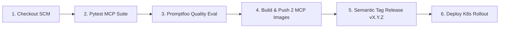

# 🔄 Hướng Dẫn Triển Khai & Vận Hành CI/CD Pipeline (Jenkins & Kubernetes)

Tài liệu hướng dẫn chi tiết quy trình thiết lập, cấu hình và vận hành hệ thống **Tích hợp và Triển khai liên tục (CI/CD)** sử dụng **Jenkins Declarative Pipeline** và **Kubernetes** theo đúng 100% mã nguồn thực tế triển khai trong dự án.

---

## 📂 1. Cấu Trúc Phân Hệ `cicd/`

```text
cicd/
├── custom_jenkins/
│   ├── Dockerfile                 # Custom Jenkins Image (Docker CLI, kubectl, Python, Promptfoo, Git)
│   └── entrypoint.sh              # Tự động cấp quyền /var/run/docker.sock
├── build_custom_jenkins.sh        # Script build custom image nhannguyen2201/jenkins:lts
├── docker-compose.yaml            # Khởi chạy Jenkins Server (:8088:8080 & :50000)
├── imgs/                          # Hình ảnh minh chứng thiết lập Credentials trong Jenkins
├── jenkins-kubeconfig.yaml        # Kubeconfig cấp quyền RBAC kết nối cụm K8s
├── Jenkinsfile                    # Jenkins Declarative Pipeline tự động hóa 6 giai đoạn
└── README.md                      # Hướng dẫn chi tiết
```

---

## 🚀 2. Khởi Chạy Jenkins Server Cục Bộ

### Bước 1: Khởi Chạy Jenkins Bằng Docker Compose
```bash
cd final_llm_agent
docker compose -f cicd/docker-compose.yaml up -d
```
Container `jenkins` chạy trên cổng **`8088`** (ánh xạ từ container port `8080`).

### Bước 2: Lấy Mật Khẩu Khởi Tạo `initialAdminPassword` (Nếu Lần Đầu Thiết Lập)
```bash
docker exec -it jenkins cat /var/jenkins_home/secrets/initialAdminPassword
```
*Truy cập giao diện web tại:* **`http://localhost:8088`**.

---

## ☸️ 3. Cấu Hình Phân Quyền RBAC & Kubeconfig Cho Jenkins

Để Jenkins có quyền triển khai và cập nhật Pods trên cụm Kubernetes, cấu hình file `kubeconfig` cấp quyền cho ServiceAccount `jenkins` kết nối API Server Kubernetes:

```bash
# Áp dụng ServiceAccount và ClusterRoleBinding
kubectl apply -f cicd/jenkins-kubeconfig.yaml
```

---

## 🔐 4. Thiết Lập Thông Tin Xác Thực (Jenkins Credentials)

Vào **Jenkins Dashboard ➔ Manage Jenkins ➔ Credentials ➔ System ➔ Global credentials**:

1. **GitHub Credentials (`github`):**
   - *Kind:* Username with password
   - *Username:* `nhannhan2201`
   - *Password:* GitHub Personal Access Token (PAT) có quyền `repo`.
   - *ID:* `github`

2. **Docker Hub Credentials (`dockerhub`):**
   - *Kind:* Username with password
   - *Username:* `nhannguyen2201`
   - *Password:* Docker Hub PAT / Token
   - *ID:* `dockerhub`

3. **Kubernetes Kubeconfig (`kubeconfig`):**
   - *Kind:* Secret file
   - *File:* File `kubeconfig` kết nối cụm Kubernetes cục bộ.
   - *ID:* `kubeconfig`

---

## 🔄 5. Quy Trình 6 Giai Đoạn Trong `Jenkinsfile`

Toàn bộ luồng tự động hóa được khai báo chi tiết trong file [`Jenkinsfile`](./Jenkinsfile):



1. **Stage 1 (Checkout SCM):** Tải mã nguồn mới nhất từ nhánh `feature` theo commit hash ngắn (`GIT_COMMIT_SHORT`).
2. **Stage 2 (Automated Test):** Kích hoạt môi trường chạy tự động các bài kiểm thử FastMCP Tools (`pytest final_llm_agent/tests/ -v`).
3. **Stage 3 (Prompt Quality Evaluation):** Sử dụng `promptfoo` đánh giá chất lượng prompt qua AI Gateway (`:32257/v1`) đối chuẩn ngữ nghĩa và schema JSON, tích hợp Langfuse Cloud.
4. **Stage 4 (Build & Push Docker Images):** Đóng gói **2 container images** cho các FastMCP Tool Servers:
   - `nhannguyen2201/ecom-mcp:${GIT_COMMIT_SHORT}`
   - `nhannguyen2201/drift-mcp:${GIT_COMMIT_SHORT}`
   Sau đó đẩy trực tiếp lên Docker Hub Registry.
5. **Stage 5 (Semantic Tag Release):** Tự động phân tích lịch sử commit (`feat!`, `feat:`, `fix:`) để bump phiên bản theo chuẩn Semantic Versioning (`vX.Y.Z`), gắn Git Tag lên GitHub và đẩy tag mới lên Docker Hub.
6. **Stage 6 (Full System Deployment to Kubernetes):** Bơm Image Tag phiên bản mới (`${targetTag}`) vào các file YAML `mcp-server.yaml` và thực thi `kubectl apply` để cập nhật FastMCP Servers và KAgent Declarative Agents lên cụm Kubernetes.

---

## 📸 6. Minh Chứng Thực Thi Thành Công

> 📸 **PIPELINE THỰC THI THÀNH CÔNG TRÊN JENKINS:**
>
> 

> 📸 **2 CONTAINER IMAGES ĐƯỢC ĐÓNG GÓI VÀ ĐẨY LÊN DOCKER HUB:**
>
> 

> 📸 **PHIÊN BẢN PHÁT HÀNH SEMANTIC RELEASE TRÊN GITHUB:**
>
> 
