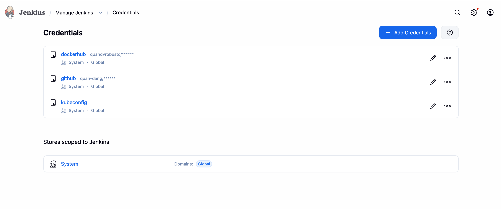
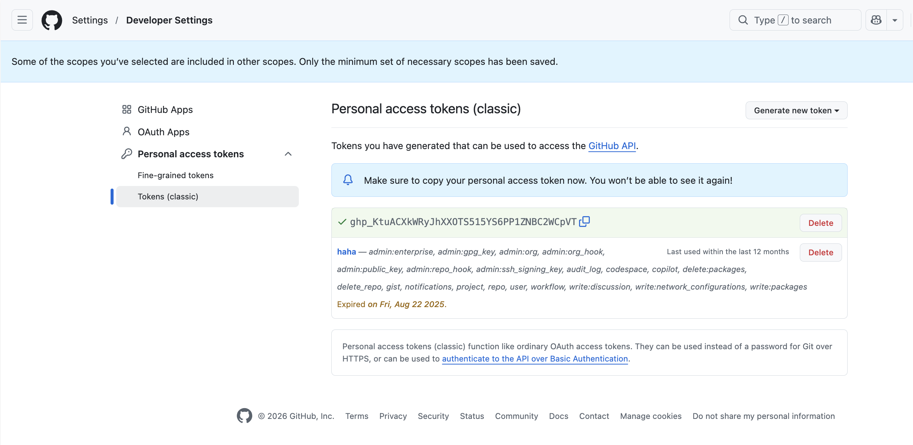
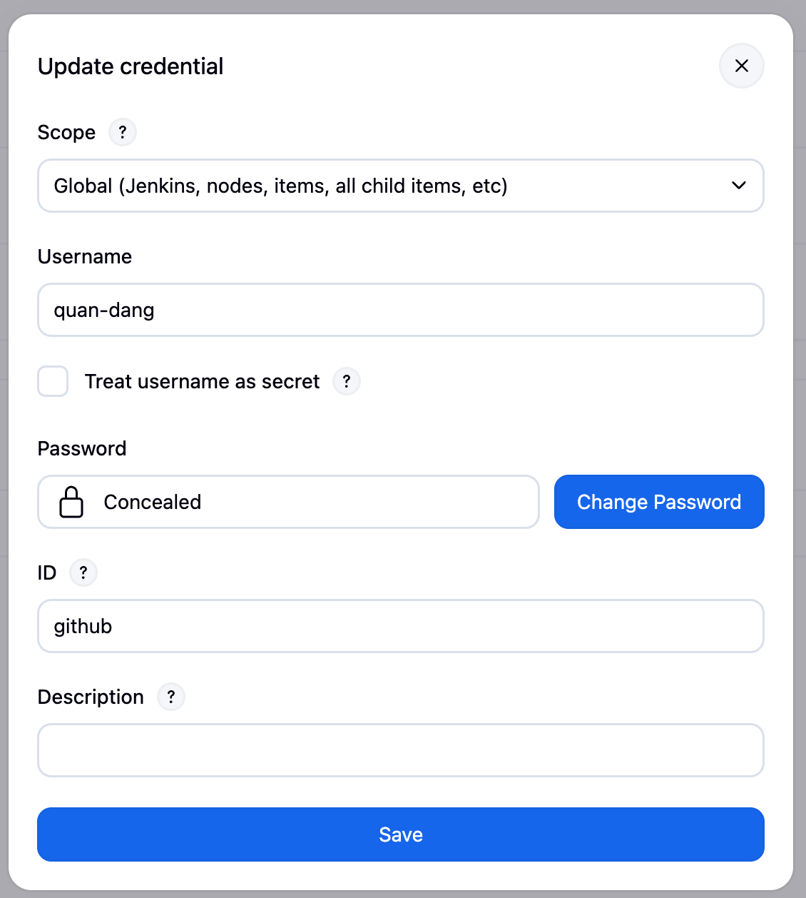
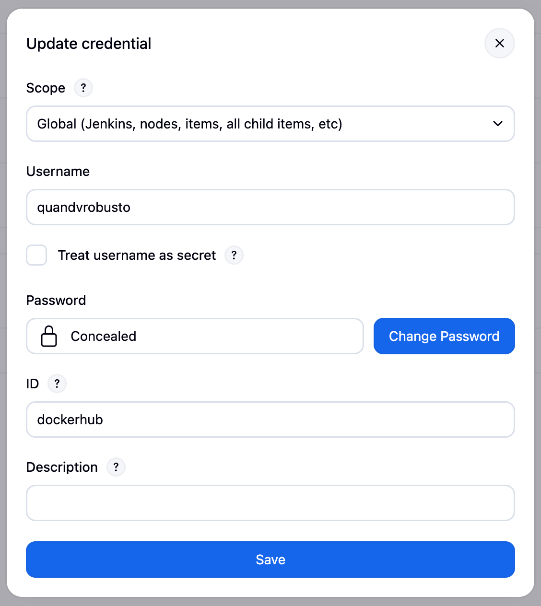
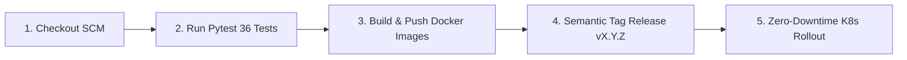

# 🔄 Hướng Dẫn Triển Khai & Vận Hành CI/CD Pipeline (Jenkins & Kubernetes)

Tài liệu hướng dẫn chi tiết quy trình thiết lập, cấu hình và vận hành hệ thống **Tích hợp và Triển khai liên tục (CI/CD)** sử dụng **Jenkins Declarative Pipeline** và **Kubernetes** theo đúng chuẩn bài lab tham khảo.

---

## 📂 1. Cấu Trúc Phân Hệ `cicd/`

```text
cicd/
├── custom_jenkins/
│   ├── Dockerfile                 # Custom Jenkins Image (Docker CLI, Helm 3, gcloud CLI, K8s Plugins)
│   └── entrypoint.sh              # Tự động cấp quyền /var/run/docker.sock
├── build_custom_jenkins.sh        # Script build custom image nhannguyen2201/jenkins:lts
├── docker-compose.yaml            # Khởi chạy Jenkins Server (:8081:8080)
├── imgs/                          # Hình ảnh minh chứng thiết lập Credentials
├── Jenkinsfile                    # Jenkins Declarative Pipeline 5 giai đoạn hoàn chỉnh
└── README.md                      # Hướng dẫn chi tiết
```

---

## 🚀 2. Hướng Dẫn Khởi Chạy Jenkins Server Cục Bộ

### Bước 1: Build Custom Jenkins Image (Nếu Cần)
```bash
bash cicd/build_custom_jenkins.sh
```

### Bước 2: Khởi Chạy Jenkins Bằng Docker Compose
```bash
docker compose -f cicd/docker-compose.yaml up -d
```

### Bước 3: Lấy Mật Khẩu Khởi Tạo `initialAdminPassword`
```bash
docker exec -it jenkins cat /var/jenkins_home/secrets/initialAdminPassword
```
*Truy cập giao diện web tại:* **`http://localhost:8081`** (hoặc `http://<IP_VM>:8081`).

---

## ☸️ 3. Cấu Hình Phân Quyền RBAC & Kubeconfig Cho Jenkins Trên Kubernetes

Để Jenkins có quyền triển khai ứng dụng lên cụm Kubernetes, cần tạo ServiceAccount `jenkins` với quyền cluster-admin:

```bash
# 1. Tạo ServiceAccount cho Jenkins trong namespace default
kubectl create serviceaccount jenkins -n default

# 2. Gán quyền cluster-admin cho ServiceAccount jenkins
kubectl create clusterrolebinding jenkins --clusterrole=cluster-admin --serviceaccount=default:jenkins

# 3. Tạo Secret Token dài hạn cho Jenkins
kubectl apply -f - <<EOF
apiVersion: v1
kind: Secret
metadata:
  name: jenkins-token
  namespace: default
  annotations:
    kubernetes.io/service-account.name: jenkins
type: kubernetes.io/service-account-token
EOF
```

### Lấy Token & Tạo File `kubeconfig` Cho Jenkins:
```bash
# Lấy Token đã giải mã Base64
TOKEN=$(kubectl get secret jenkins-token -n default -o jsonpath='{.data.token}' | base64 -d)

# Lấy CA Data từ kubeconfig hiện tại
CA_DATA=$(kubectl config view --raw --minify --flatten -o jsonpath='{.clusters[0].cluster.certificate-authority-data}')
SERVER_URL=$(kubectl config view --raw --minify --flatten -o jsonpath='{.clusters[0].cluster.server}')

# Lưu cấu hình sau vào file kubeconfig:
cat <<EOF > kubeconfig
apiVersion: v1
kind: Config
clusters:
- cluster:
    server: ${SERVER_URL}
    certificate-authority-data: ${CA_DATA}
  name: k8s-cluster
contexts:
- context:
    cluster: k8s-cluster
    user: jenkins
  name: k8s-cluster
current-context: k8s-cluster
users:
- name: jenkins
  user:
    token: ${TOKEN}
EOF
```

---

## 🔐 4. Thiết Lập Thông Tin Xác Thực (Jenkins Credentials)

Vào **Jenkins Dashboard ➔ Manage Jenkins ➔ Credentials ➔ System ➔ Global credentials (unrestricted)**:



1. **GitHub Credentials (`github`):**
   - *Kind:* Username with password
   - *Username:* `<Tên GitHub của bạn>`
   - *Password:* GitHub Personal Access Token (PAT) có quyền `repo` và `admin:repo_hook`.
   - *ID:* `github`
   
   

2. **Docker Hub Credentials (`dockerhub`):**
   - *Kind:* Username with password
   - *Username:* `nhannguyen2201`
   - *Password:* Docker Hub PAT / Token
   - *ID:* `dockerhub`
   

3. **Kubernetes Kubeconfig (`kubeconfig`):**
   - *Kind:* Secret file
   - *File:* Chọn file `kubeconfig` vừa tạo ở trên.
   - *ID:* `kubeconfig`

---

## 🔄 5. Quy Trình 5 Giai Đoạn Trong `Jenkinsfile`



1. **Stage 1 (Checkout):** Tải mã nguồn mới nhất theo commit hash ngắn (`GIT_COMMIT_SHORT`).
2. **Stage 2 (Test):** Kích hoạt môi trường thực thi tự động chạy toàn bộ **36 Pytest test cases** (`pytest tests/ -v --cov=apps`).
3. **Stage 3 (Build & Push):** Đóng gói song song 4 Docker Images (`feature-api`, `drift-api`, `ecom-mcp`, `drift-mcp`) và đẩy lên Docker Hub Registry với tag `${GIT_COMMIT_SHORT}` và `latest`.
4. **Stage 4 (Tag Release):** Tự động phân tích commit messages (`feat!`, `feat:`, `fix:`) để tăng version theo chuẩn Semantic Versioning (`vX.Y.Z`), gắn git tag và đẩy lên GitHub.
5. **Stage 5 (Deploy):** Kết nối K8s qua `kubeconfig`, áp dụng manifests và thực hiện `kubectl rollout restart` đảm bảo **Zero-Downtime Deployment**.
