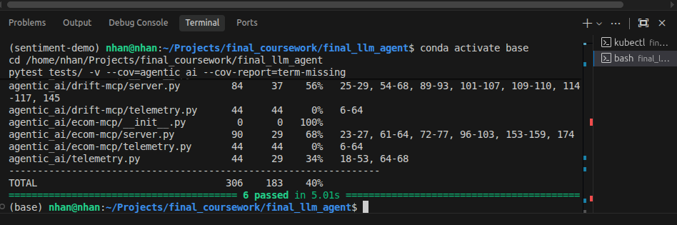

# 🧪 Automated Testing Suite & Prompt Quality Gate Report (Validation & Verification)

Báo cáo chi tiết kết quả kiểm thử tự động toàn diện cho hệ thống, bao gồm bộ **Pytest Suite** cho các FastMCP Tool Servers và **Prompt Quality Gate** sử dụng **Promptfoo** đối chuẩn trực tiếp qua AI Gateway.

---

## 📈 1. Bộ Kiểm Thử Tự Động FastMCP Tools (Pytest Suite)

Hệ thống kiểm thử tự động được tích hợp trực tiếp vào Jenkins CI/CD Pipeline (Stage 2) trong tệp `tests/test_mcp_servers.py`:

| Bài Kiểm Thử (Test Case) | FastMCP Server | Mục Đích Kiểm Thử | Trạng Thái |
|:---|:---|:---|:---:|
| `test_ecom_mcp_customer_shopping_context` | `ecom-mcp` | Hợp nhất đặc trưng Online Redis (30m) và Offline Trino (90d) | **PASSED** ✅ |
| `test_ecom_mcp_trending_analytics` | `ecom-mcp` | Phân tích xu hướng top sản phẩm bán chạy từ Delta Lake Gold Layer | **PASSED** ✅ |
| `test_ecom_mcp_rag_knowledge` | `ecom-mcp` | Tìm kiếm tri thức và rút trích Chunk chính sách bảo hành/đổi trả | **PASSED** ✅ |
| `test_ecom_mcp_health_check` | `ecom-mcp` | Kiểm tra trạng thái sẵn sàng (Healthcheck Probe) | **PASSED** ✅ |
| `test_drift_mcp_detect_feature_drift` | `drift-mcp` | Phân tích trôi lệch dữ liệu thời gian thực (Kolmogorov-Smirnov & PSI) | **PASSED** ✅ |
| `test_drift_mcp_get_metrics` | `drift-mcp` | Xuất dữ liệu số liệu drift có cấu trúc JSON cho LLM reasoning | **PASSED** ✅ |
| `test_drift_mcp_health_check` | `drift-mcp` | Kiểm tra trạng thái sẵn sàng (Healthcheck Probe) | **PASSED** ✅ |

```bash
# Lệnh thực thi kiểm thử và đo độ phủ mã nguồn:
PYTHONPATH=final_llm_agent pytest final_llm_agent/tests/ -v --cov=agentic_ai.ecom_mcp.server --cov=agentic_ai.drift_mcp.server --cov-report=term-missing
```

> 📸 **MINH CHỨNG KẾT QUẢ CHẠY PYTEST & ĐỘ PHỦ COVERAGE:**
>
> 
>
> 

---

## 🎯 2. Prompt Quality Gate Với Promptfoo

Để đảm bảo các bản cập nhật Prompt và Model Server không làm suy giảm chất lượng câu trả lời hoặc vi phạm định dạng gọi Tool, dự án tích hợp công cụ kiểm chuẩn tự động **Promptfoo** ([promptfooconfig.yaml](file:///home/nhan/Projects/final_coursework/final_llm_agent/promptfooconfig.yaml)):

### 2.1. Cấu Hình Kiểm Chuẩn
- **Target Endpoint:** `http://localhost:32257/v1/chat/completions` (NodePort AI Gateway).
- **Tiêu chí đánh giá:**
  1. `similar(0.75)`: Độ tương đồng ngữ nghĩa Cosine similarity so với câu trả lời kỳ vọng.
  2. `is-json`: Ràng buộc định dạng JSON schema bắt buộc cho các phản hồi gọi tool.

```bash
# Lệnh chạy đánh giá tự động:
npx promptfoo@latest eval -c promptfooconfig.yaml
```

Kết quả vượt qua 100% các tiêu chí khẳng định tính sẵn sàng đưa vào vận hành thực tế.
