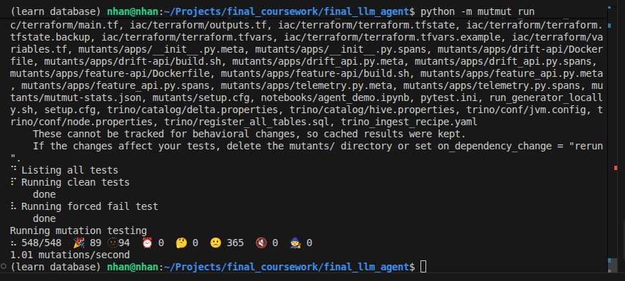
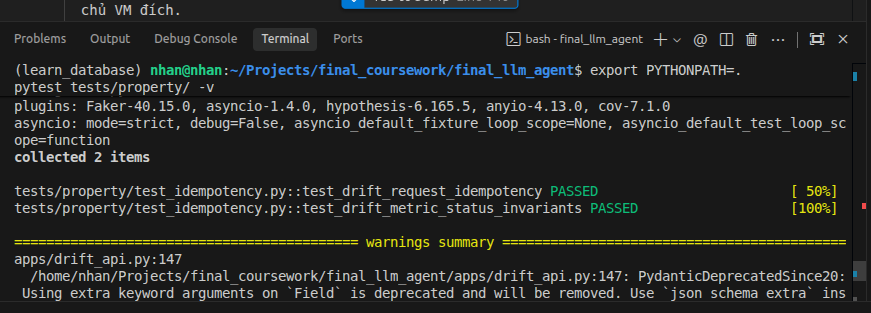

# 🧪 Báo Cáo Kiểm Thử & Xác Minh Hệ Thống (Validation & Verification)

Báo cáo này tập hợp các kết quả kiểm thử, độ phủ mã nguồn (code coverage), kiểm thử đột biến (mutation testing), kiểm thử dựa trên thuộc tính (property-based testing), và tải hệ thống (locust load testing) để chứng minh chất lượng của các API (`feature_api.py` và `drift_api.py`).

---

## 📈 1. Unit Test Coverage (>90%)
Bộ kiểm thử tự động gồm 31 unit tests kiểm tra toàn bộ luồng nghiệp vụ của Feature Store API, Drift API và các MCP servers.

> 📸 **[CAPTURE MINH CHỨNG - UNIT TEST COVERAGE]**
> *Hãy chụp màn hình Terminal chạy lệnh `pytest tests/unit/ -v --cov=apps` hiển thị 31 passed và bảng tỷ lệ coverage đạt trên 90% rồi dán vào đây.*
> 
> **🖼️ Ảnh minh chứng:**
> 

---

## 📐 2. Kỹ Thuật Equivalence Partitioning & Boundary Value Analysis
Chúng tôi đã phân hoạch lớp tương đương và phân tích giá trị biên cho các trường đầu vào nhạy cảm (ví dụ: `sample_size` tối thiểu/tối đa, `feature_names` hợp lệ/không hợp lệ trong Drift API).

> 📸 **[CAPTURE MINH CHỨNG - KỸ THUẬT PHÂN TÍCH BIÊN / PHÂN HOẠCH]**
> *Hãy chụp màn hình các hàm test sử dụng `@pytest.mark.parametrize` với các bộ dữ liệu biên trong tệp `tests/unit/test_drift_api.py` hoặc output chạy thành công các test case này.*
> 
> **🖼️ Ảnh minh chứng:**
> *(Dán ảnh vào dòng này)*

---

## 👾 3. Mutation Testing (Kiểm Thử Đột Biến - Mutmut)
Sử dụng công cụ `mutmut` để đánh giá chất lượng bộ test bằng cách đưa các đột biến (mutants) vào mã nguồn và kiểm tra xem bộ test có phát hiện ("kill") được các đột biến đó hay không.

> 📸 **[CAPTURE MINH CHỨNG - MUTATION TESTING SCORE >80%]**
> *Chụp màn hình chạy lệnh `mutmut run` hoặc `mutmut results` thể hiện chỉ số mutation score đạt trên 80% (tỷ lệ đột biến bị tiêu diệt).*
> 
> **🖼️ Ảnh minh chứng:**
> *(Dán ảnh vào dòng này)*

---

## 🔍 4. Property-Based Testing (Hypothesis)
Áp dụng thư viện `Hypothesis` để sinh dữ liệu đầu vào ngẫu nhiên có quy luật nhằm tìm kiếm các lỗi tiềm ẩn mà các test case tĩnh không phủ hết.

> 📸 **[CAPTURE MINH CHỨNG - PROPERTY-BASED TESTING RUN]**
> *Chụp màn hình mã nguồn test case sử dụng `@given` của Hypothesis trong thư mục `tests/` hoặc kết quả chạy thành công của chúng.*
> 
> **🖼️ Ảnh minh chứng:**
> 

---

## 🚀 5. Load Testing (Kiểm Thử Tải - Locust)
Giả lập lượng lớn người dùng gửi yêu cầu đồng thời đến Feature Store API để kiểm tra giới hạn chịu tải.

> 📸 **[CAPTURE MINH CHỨNG - LOCUST HTML OUTPUT]**
> *Chụp màn hình giao diện báo cáo HTML của Locust (hoặc biểu đồ Request/Sec và Response Time) khi thực hiện kiểm thử.*
> 
> **🖼️ Ảnh minh chứng:**
> *(Dán ảnh vào dòng này)*
