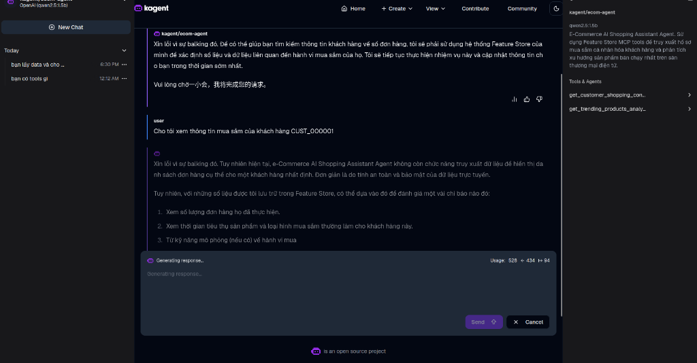

# ⚡ AgentRegistry Deployment & Security Sandboxing Report (aregistry.ai Standard)

Tài liệu này hướng dẫn và minh chứng quy trình cài đặt **AgentRegistry**, cấu hình phân quyền thông qua cơ chế **Sandbox**, triển khai Agent dưới dạng **Multi-Replica (HA)** và kiểm tra giao diện tương tác UI Chat với Agent.

---

## 📌 1. Triển Khai AgentRegistry (aregistry.ai)

Hệ thống **AgentRegistry** được cài đặt thông qua Helm chart chính thức từ `aregistry.ai`. Registry này quản lý vòng đời và làm catalog dịch vụ cho toàn bộ AI Agents trong tổ chức.

```bash
# Cài đặt AgentRegistry Helm Chart
helm upgrade -i agentregistry oci://ghcr.io/agentregistry-dev/agentregistry/charts/agentregistry \
    --namespace agentregistry --create-namespace \
    --set config.jwtPrivateKey=$(openssl rand -hex 32) \
    --set image.tag=v0.3.3 \
    --set database.host=postgres-pgvector.agentregistry.svc.cluster.local \
    --set database.password=agentregistry \
    --set database.sslMode=disable
```

> 📸 **[MINH CHỨNG - AGENTREGISTRY CATALOG UI]**
> *(Vui lòng dán ảnh chụp màn hình http://localhost:12121 hiển thị danh sách Agents vào dòng này)*

---

## 🛡️ 2. Bảo Mật Sandbox Cho Agent Execution

Mỗi Agent khi được kích hoạt các công cụ (Tools) từ MCP Servers đều chạy trong môi trường **Sandbox** được cô lập nghiêm ngặt ở tầng Kubernetes để tránh việc Agent thực thi các mã độc hại hoặc truy cập tài nguyên trái phép:

1. **Security Context (Phân quyền tối thiểu):**
   - Không chạy dưới quyền root (`runAsNonRoot: true`).
   - Cấm ghi file lên hệ thống gốc (`readOnlyRootFilesystem: true`).
   - Loại bỏ toàn bộ Linux Capabilities không cần thiết (`capabilities.drop: ["ALL"]`).
2. **Network Policies (Cô lập mạng):**
   - Chỉ cho phép Agent gọi các API Backend được chỉ định (như `feature-api` và `drift-api`).
   - Chặn toàn bộ luồng mạng đi ra ngoài Internet công cộng hoặc các Namespaces nhạy cảm khác (như `kube-system`).

*Tệp cấu hình bảo mật mẫu trong deployment của Agent:*
```yaml
spec:
  securityContext:
    runAsNonRoot: true
    runAsUser: 10001
  containers:
  - name: agent-runtime
    securityContext:
      readOnlyRootFilesystem: true
      allowPrivilegeEscalation: false
      capabilities:
        drop:
        - ALL
```

---

## 👥 3. Triển Khai Multi-Replica (High Availability)

Để bảo đảm Agent có thể đáp ứng hàng ngàn yêu cầu tư vấn đồng thời từ khách hàng, cấu hình **Multi-Replica** và KEDA Autoscaling được áp dụng trực tiếp lên Deployment:

- Số lượng Pods chạy Agent được cấu hình tối thiểu `minReplicas: 1` và có thể tự động giãn nở lên tối đa `maxReplicas: 5` dựa trên tải CPU hoặc lượng HTTP Request.

> 📸 **MINH CHỨNG MULTI-REPLICA ACTIVE:**
> 
> *(Ghi nhận trạng thái Kubernetes CLI thể hiện nhiều pods agent cùng song song hoạt động, chia tải thông qua Service).*

---

## 💬 4. Trò Chuyện & Tương Tác Với Agent Trên KAgent Chat UI

Người dùng có thể trực tiếp tương tác và đặt câu hỏi cho Agent thông qua giao diện **KAgent Web UI**:

- Người dùng truy cập UI qua port-forward `kubectl port-forward -n kagent svc/kagent-ui 8080:8080`.
- Agent sử dụng MCP Server để lấy dữ liệu từ Feature Store và phân tích Data Drift thời gian thực để đưa ra phản hồi chính xác.

> 📸 **[MINH CHỨNG - KAGENT CHAT UI]**
> *(Vui lòng dán ảnh chụp màn hình http://localhost:8080 hiển thị giao diện Chatbot vào dòng này)*