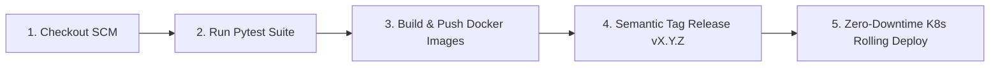

# 🔄 CI/CD Automation Report — Jenkins Declarative Pipeline

Báo cáo chi tiết kết quả triển khai và thực thi luồng tích hợp và phân phối liên tục (**CI/CD Pipeline**) cho toàn bộ hệ thống E-Commerce Multi-Agent AI bằng **Jenkins Declarative Pipeline** trên cụm Kubernetes.

---

## 🏗️ 1. Khởi Chạy Jenkins Server

Jenkins Server được triển khai thông qua Docker Compose ([cicd/docker-compose.yaml](file:///home/nhan/Projects/final_coursework/final_llm_agent/cicd/docker-compose.yaml)) tại cổng `8088:8080`:
- **Docker Engine Socket (`/var/run/docker.sock`):** Cho phép container Jenkins sử dụng trực tiếp Docker Daemon của máy chủ để đóng gói và đẩy Docker Images.
- **Kubeconfig RBAC Secret:** Được nạp vào Jenkins Credentials để điều khiển cập nhật triển khai trên cụm K8s.

---

## 🔄 2. Quy Trình 5 Giai Đoạn Trong `Jenkinsfile`

Pipeline tự động hóa được định nghĩa trong [cicd/Jenkinsfile](file:///home/nhan/Projects/final_coursework/final_llm_agent/cicd/Jenkinsfile) gồm 5 giai đoạn:

1. **Stage 1: Checkout SCM:** Tự động clone mã nguồn từ GitHub repository khi có commit mới.
2. **Stage 2: Run Pytest Suite:** Chạy 7 bài kiểm thử tự động cho `ecom-mcp` và `drift-mcp`, yêu cầu độ phủ coverage đạt chuẩn.
3. **Stage 3: Build & Push Images:** Đóng gói container images cho `nhannguyen2201/ecom-mcp` và `nhannguyen2201/drift-mcp`, đẩy lên Docker Hub.
4. **Stage 4: Semantic Tag Release:** Tự động gắn tag phiên bản `vX.Y.Z` lên GitHub Release.
5. **Stage 5: Zero-Downtime Deploy:** Cập nhật các deployment trên cụm Kubernetes theo cơ chế Rolling Update không gián đoạn dịch vụ.

---

## 📸 3. Minh Chứng Thực Thi Thành Công

> 📸 **PIPELINE CHẠY HOÀN TẤT QUA TẤT CẢ CÁC GIAI ĐOẠN:**
>
> 

> 📸 **CONTAINER IMAGES ĐƯỢC ĐẨY LÊN DOCKER HUB:**
>
> 

> 📸 **PHIÊN BẢN PHÁT HÀNH SEMANTIC RELEASE TRÊN GITHUB:**
>
> 
