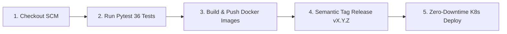
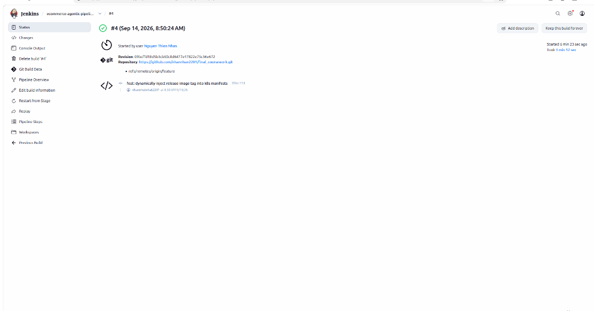
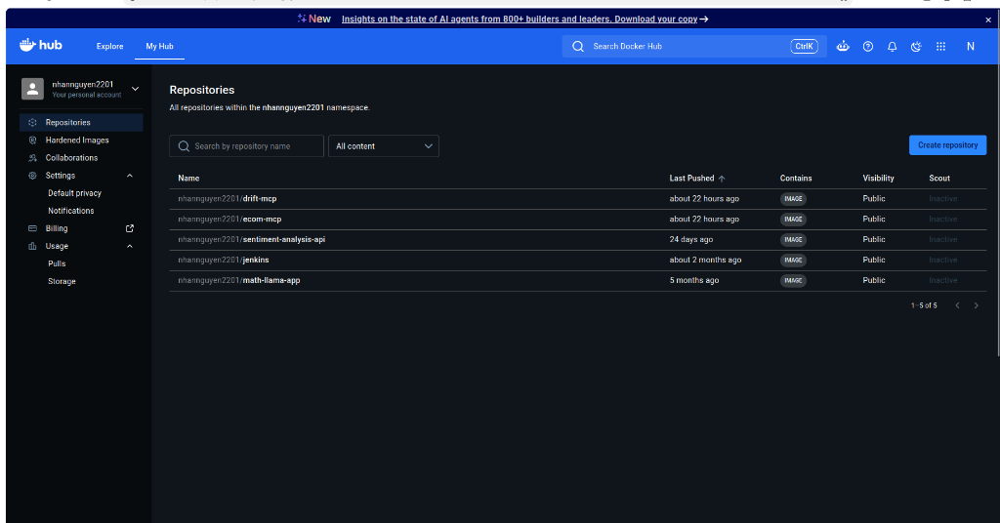
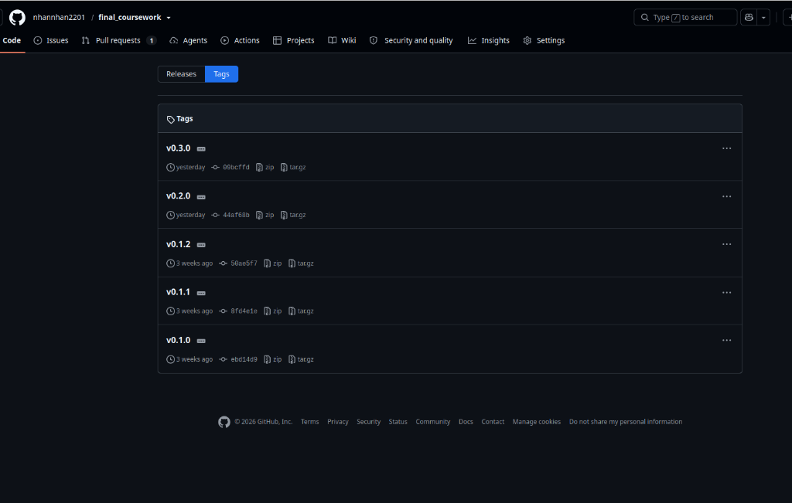

# 🔄 CI/CD Automation Report — Jenkins Declarative Pipeline

Báo cáo kết quả triển khai và thực thi luồng tích hợp và triển khai tự động (**CI/CD Pipeline**) cho toàn bộ hệ thống E-Commerce MLOps, Web APIs, MCP servers và KAgent AI Agents bằng **Jenkins Declarative Pipeline** trên cụm Kubernetes.

---

## 🏗️ 1. Kiến Trúc Khởi Chạy Custom Jenkins Server

Jenkins Server được triển khai thông qua Docker Compose ([cicd/docker-compose.yaml](file:///home/nhan/Projects/final_coursework/final_llm_agent/cicd/docker-compose.yaml)) tại cổng `8081:8080` trên máy ảo VM:
- **Docker Engine Socket (`/var/run/docker.sock`):** Cho phép Jenkins mượn trực tiếp Docker Daemon của máy ảo VM để build và push Docker images.
- **Core Plugins:** `git`, `workflow-aggregator`, `docker-workflow`, `credentials-binding`.

```bash
# Khởi chạy Jenkins Server trên VM
cd final_llm_agent/cicd
docker compose up -d
# Truy cập giao diện: http://<IP_PUBLIC_VM>:8081 (User: admin)
```

---

## ☸️ 2. Thiết Lập Phân Quyền RBAC & Kubeconfig Cho Jenkins Trên K8s

```bash
# 1. Khởi tạo ServiceAccount cho Jenkins
kubectl create serviceaccount jenkins -n default
kubectl create clusterrolebinding jenkins --clusterrole=cluster-admin --serviceaccount=default:jenkins

# 2. Tạo Secret Token dài hạn
kubectl apply -f - <<EOF
apiVersion: v1
kind: Secret
metadata:
  name: jenkins-token
  namespace: default
  annotations:
    kubernetes.io/service-account.name: jenkins
type: kubernetes.io/service-account-token
EOF
```

---

## 🔐 3. Cấu Hình Thông Số Xác Thực (Jenkins Credentials)

Hệ thống Jenkins thiết lập 3 bộ Credentials bảo mật (`http://<IP_PUBLIC_VM>:8081/credentials`):
1. **`github` (Username with Password):** GitHub Personal Access Token (PAT) với quyền `repo` và `admin:repo_hook` để clone code và push Semantic Git Release Tags.
2. **`dockerhub` (Username with Password):** Tài khoản Docker Hub `nhannguyen2201` để push 4 container images (`feature-api`, `drift-api`, `ecom-mcp`, `drift-mcp`).
3. **`kubeconfig` (Secret File):** File cấu hình kết nối K8s Cluster đã được gắn token của ServiceAccount `jenkins`.

---

## 🔄 4. Quy Trình 5 Giai Đoạn Trong `Jenkinsfile`



1. **Stage 1 (Checkout):** Tải mã nguồn mới nhất từ Git Repository theo commit hash ngắn (`GIT_COMMIT_SHORT`).
2. **Stage 2 (Test):** Kích hoạt môi trường thực thi tự động chạy toàn bộ **36 Pytest test cases** (`pytest tests/ -v --cov=apps`).
3. **Stage 3 (Build & Push):** Đóng gói song song 4 Docker Images (`feature-api`, `drift-api`, `ecom-mcp`, `drift-mcp`) và đẩy lên Docker Hub Registry với tag `${GIT_COMMIT_SHORT}` và `latest`.
4. **Stage 4 (Tag Release):** Tự động phân tích commit messages (`feat!`, `feat:`, `fix:`) để tăng version theo chuẩn Semantic Versioning (`vX.Y.Z`), gắn git tag và đẩy lên GitHub.
5. **Stage 5 (Deploy):** Kết nối K8s qua `kubeconfig`, áp dụng manifests và thực hiện `kubectl rollout restart` đảm bảo **Zero-Downtime Deployment**.

> 📸 **MINH CHỨNG JENKINS PIPELINE 5 STAGES THÀNH CÔNG:**
>
> *(Chèn ảnh chụp màn hình giao diện Jenkins Pipeline Stage View hiển thị toàn bộ 5 Stages màu xanh lá cây SUCCESS tại đây)*
>
> 

---

## 🐳 5. Minh Chứng Docker Hub Images & GitHub Release Tag

> 📸 **MINH CHỨNG DOCKER HUB REPOSITORIES:**
>
> *(Chèn ảnh chụp màn hình trang web Docker Hub hiển thị 4 repositories `feature-api`, `drift-api`, `ecom-mcp`, `drift-mcp` với tag mới nhất tại đây)*
>
> 

> 📸 **MINH CHỨNG GITHUB RELEASES & TAGS:**
>
> *(Chèn ảnh chụp màn hình trang GitHub Releases hiển thị tag phiên bản tự động do Jenkins đẩy lên tại đây)*
>
> 
