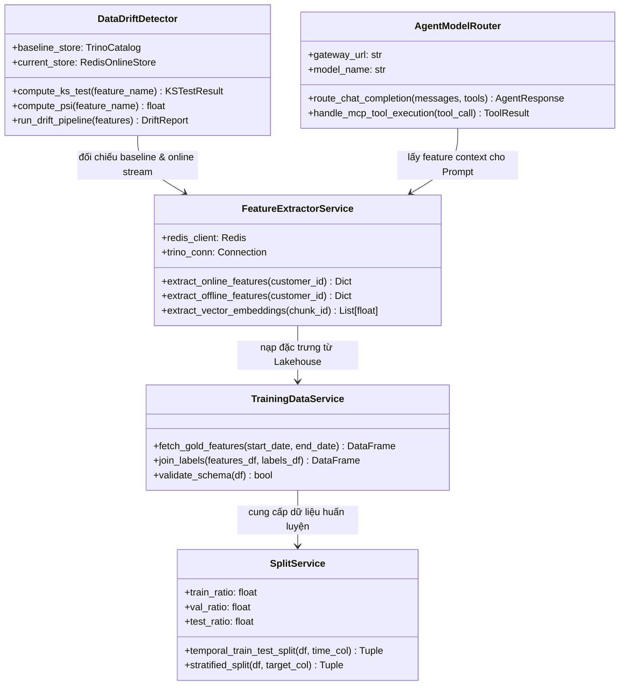

# 🧩 Software Design Patterns & Low-Level ML Architecture

Báo cáo chi tiết về việc ứng dụng các mẫu thiết kế phần mềm (**Design Patterns**) và thiết kế kiến trúc mức thấp (**Low-Level ML Design**) trong hệ thống Agentic AI & MLOps Infrastructure.

---

## 🎨 1. Software Design Patterns

### 1.1. Strategy Pattern (Mẫu Chiến Lược)
- **Vị trí áp dụng:** Bộ mã nguồn phân tích Data Drift (`apps/drift_api.py` và `drift-mcp/server.py`).
- **Chi tiết:** Cho phép hoán đổi linh hoạt giữa các thuật toán kiểm định độ lệch phân phối dữ liệu (Kolmogorov-Smirnov Test, Population Stability Index - PSI, Wasserstein Distance) mà không làm thay đổi luồng nghiệp vụ chính của API.

```python
from abc import ABC, abstractmethod
import numpy as np
from scipy import stats

class DriftStrategy(ABC):
    @abstractmethod
    def evaluate(self, baseline: np.ndarray, current: np.ndarray) -> dict:
        pass

class KSTestStrategy(DriftStrategy):
    def evaluate(self, baseline: np.ndarray, current: np.ndarray) -> dict:
        res = stats.ks_2samp(baseline, current)
        return {"statistic": float(res.statistic), "p_value": float(res.pvalue), "drift": res.pvalue < 0.05}

class PSIStrategy(DriftStrategy):
    def evaluate(self, baseline: np.ndarray, current: np.ndarray) -> dict:
        psi = calculate_psi(baseline, current)
        return {"psi_score": psi, "drift": psi > 0.25}
```

---

### 1.2. Adapter Pattern (Mẫu Thích Ứng)
- **Vị trí áp dụng:** Bộ kết nối dữ liệu Feature Store (`apps/feature_api.py`).
- **Chi tiết:** Đóng vai trò làm adapter chuyển đổi giao thức và cấu trúc lưu trữ khác nhau (Redis Online Store với key-value hash và Trino/Delta Lake với SQL relational rows) thành định dạng chuẩn Pydantic Model (`CustomerFeatureResponse`) mà LLM Agents có thể hiểu và tiêu thụ trực tiếp.

```python
class FeatureStoreAdapter:
    def __init__(self, redis_client, trino_client):
        self.redis = redis_client
        self.trino = trino_client

    async def get_unified_customer_features(self, customer_id: str) -> CustomerFeatureResponse:
        # Fetch from disparate sources
        online_data = await self._fetch_redis_hash(customer_id)
        offline_data = await self._query_trino_sql(customer_id)
        # Adapt and harmonize into unified domain entity
        return CustomerFeatureResponse(
            customer_id=customer_id,
            views_last_30m=online_data.get("views_30m", 0),
            f_customer_avg_order_value_90d=offline_data.get("avg_order_val", 0.0),
            retrieved_at=datetime.utcnow().isoformat()
        )
```

---

### 1.3. Registry & Factory Pattern
- **Vị trí áp dụng:** Quản lý vòng đời Agents và MCP Tools (`coordinator-agent`, `AgentRegistry`).
- **Chi tiết:** Đăng ký và khởi tạo động các MCP Tools và Agent Executors theo cấu hình Declarative YAML trên Kubernetes.

---

## 🏗️ 2. Low-Level ML Design (5 Key Classes)

Dưới đây là thiết kế chi tiết 5 lớp cốt lõi (**5 Key Classes**) cấu thành nên hạ tầng MLOps và LLM Agent trong dự án:



### Chi Tiết Trách Nhiệm Từng Lớp:
1. **`TrainingDataService`**: Chịu trách nhiệm trích xuất dữ liệu giao dịch từ tầng Gold (`feat_customer_unified`), thực hiện join với bảng nhãn (`customer_labels`), và kiểm tra schema ràng buộc.
2. **`SplitService`**: Phân chia tập dữ liệu thành các tập Train, Validation, Test theo phương pháp phân tách thời gian (Temporal Split) hoặc phân tầng (Stratified Split) tránh rò rỉ dữ liệu (Data Leakage).
3. **`FeatureExtractorService`**: Trích xuất đặc trưng thời gian thực từ Redis (`<1ms`) và đặc trưng lịch sử từ Trino/Delta Lake, đồng thời cung cấp vector embeddings 384D cho RAG search.
4. **`DataDriftDetector`**: Thực hiện tính toán thống kê kiểm định giả thuyết trôi lệch dữ liệu KS-Test và PSI giữa tập dữ liệu tham chiếu (Delta Lake) và dòng dữ liệu trực tuyến (Redis).
5. **`AgentModelRouter`**: Điều phối luồng gọi mô hình LLM qua AgentGateway, quản lý việc gắn kèm công cụ MCP (`ecom-mcp`, `drift-mcp`) và xử lý phản hồi dạng Stream.
