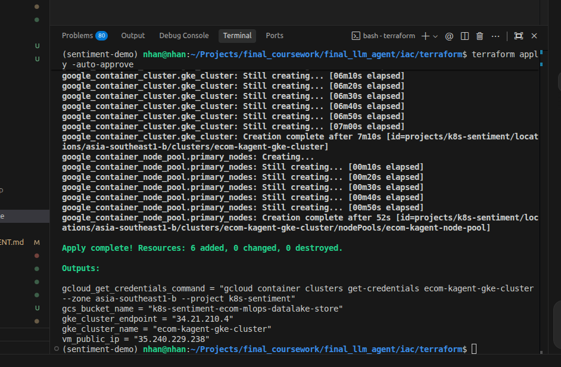
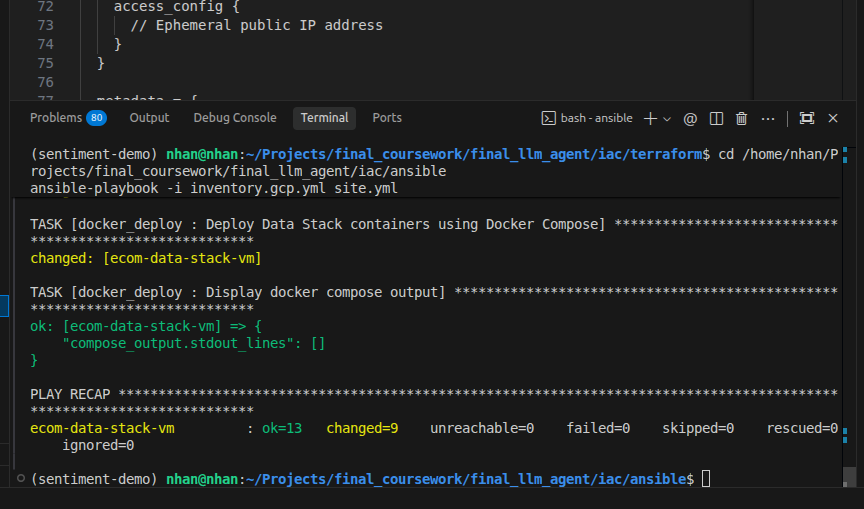

# 🛠️ Infrastructure as Code (IaC) — Terraform & Ansible Report

Tài liệu báo cáo chi tiết thiết lập hạ tầng đám mây tự động bằng Terraform và cấu hình máy chủ ảo tự động sử dụng Ansible.

---

## ☁️ 1. Cấp Phát Tài Nguyên Cloud Với Terraform (GKE & VM)
Sử dụng mã nguồn Terraform (`iac/terraform/`) để khởi tạo máy ảo Compute Engine VM và cụm Google Kubernetes Engine (GKE).

```bash
cd iac/terraform
terraform init
terraform apply -auto-approve
```

> 📸 **MINH CHỨNG TERRAFORM APPLY SUCCESS:**
>
> *(Chèn ảnh chụp màn hình kết quả chạy lệnh `terraform apply` thành công hiển thị số tài nguyên đã thêm `Apply complete! Resources: X added, 0 changed, 0 destroyed` tại đây)*
> 
> 

---

## 📦 2. Cấu Hình Máy Chủ Tự Động Với Ansible (Data Stack & VM Services)
Sử dụng Ansible playbook (`iac/ansible/`) để cấu hình hệ điều hành Ubuntu, cài đặt Docker, MinIO, Trino, Redis, Kafka, Airflow trên máy ảo VM.

```bash
cd iac/ansible
ansible-playbook -i inventory.gcp.yml site.yml
```

> 📸 **MINH CHỨNG ANSIBLE PLAYBOOK SUCCESS:**
>
> *(Chèn ảnh chụp màn hình kết quả chạy lệnh `ansible-playbook` hiển thị phần tổng kết `PLAY RECAP` với trạng thái `failed=0` tại đây)*
> 
> 
