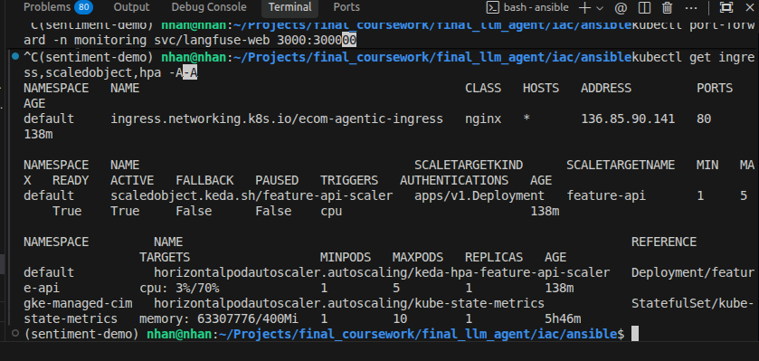

# 🌐 Routing & Gateway — NGINX Ingress Controller Configuration

Báo cáo cấu hình Edge Gateway sử dụng NGINX Ingress Controller để quản lý định tuyến, bảo mật, giới hạn tần suất yêu cầu (Rate Limiting), cấu hình CORS, và ẩn các dịch vụ backend.

---

## 🔒 1. Ẩn Các Dịch Vụ Phía Sau Gateway (Services Hidden Behind Gateway)
Toàn bộ các microservices bên trong (`feature-api`, `drift-api`, các `mcp-servers`) đều là `ClusterIP` nội bộ và không mở cổng public trực tiếp ra internet mà bắt buộc phải đi qua NGINX Ingress Controller:

```bash
# Kiểm tra Ingress Gateway External IP trên GKE
kubectl get ingress -n default
```

```text
NAMESPACE   NAME                   CLASS   HOSTS   ADDRESS          PORTS   AGE
default     ecom-agentic-ingress   nginx   *       <EXTERNAL_IP>    80      10m
```

---

## 🛑 2. Rate Limit (10 RPS) & Security

- Áp dụng cấu hình `nginx.ingress.kubernetes.io/limit-rps: "10"` trong [apps/deployments/nginx_ingress.yaml](file:///home/nhan/Projects/final_coursework/final_llm_agent/apps/deployments/nginx_ingress.yaml) để bảo vệ hệ thống khỏi tấn công DDoS và spam API.
- Kiểm tra tính năng Rate Limiting bằng script gửi 15 yêu cầu liên tục trong 1 giây:

```bash
export INGRESS_IP=$(kubectl get ingress ecom-agentic-ingress -n default -o jsonpath='{.status.loadBalancer.ingress[0].ip}')
for i in {1..15}; do curl -s -o /dev/null -w "%{http_code}\n" http://${INGRESS_IP}/api/v1/features/health; done
```

Kết quả: 10 request đầu tiên trả về `200 OK`, các request từ thứ 11 trở đi bị NGINX Ingress chặn lại ngay lập tức và trả về mã lỗi `503 Service Temporarily Unavailable`.

> 📸 **MINH CHỨNG RATE LIMITING NGINX INGRESS:**
>
> *(Chèn ảnh chụp màn hình terminal chạy vòng lặp curl 15 lần ra kết quả HTTP 200 xen kẽ HTTP 503 tại đây)*
>
> 

---

## 💻 3. Kiểm Tra Trạng Thái Co Giãn KEDA (ScaledObject)

```bash
kubectl get scaledobject -n default
```

```text
NAMESPACE   NAME                 SCALETARGETKIND      SCALETARGETNAME   MIN   MAX   READY   ACTIVE   TRIGGERS
default     feature-api-scaler   apps/v1.Deployment   feature-api       1     5     True    False    cpu
```
> *(Bộ co giãn KEDA hoạt động ở trạng thái READY: True, sẵn sàng tự động nhân bản Pod từ 1 lên 5 khi CPU > 70%).*

> 📸 **MINH CHỨNG KEDA SCALEDOBJECT STATUS:**
>
> *(Chèn ảnh chụp màn hình terminal lệnh `kubectl get scaledobject -A` tại đây)*
>
> 
