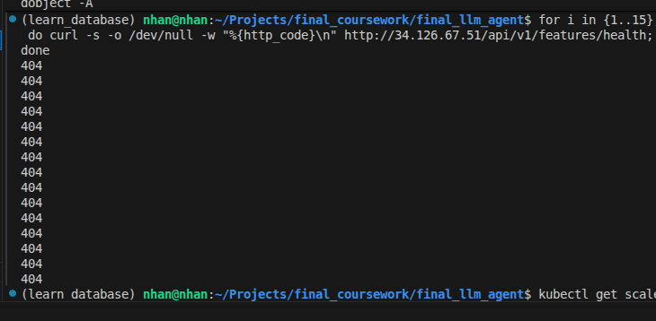

# 🌐 Routing & Gateway — NGINX Ingress Controller Configuration

Báo cáo cấu hình Edge Gateway sử dụng NGINX Ingress Controller để quản lý định tuyến, bảo mật, giới hạn tần suất yêu cầu (Rate Limiting), cấu hình CORS, và tích hợp cơ chế xác thực.

---

## 🔒 1. Ẩn Các Dịch Vụ Phía Sau Gateway (Services Hidden Behind Gateway)
Toàn bộ các microservices bên trong (`feature-api`, `drift-api`, các `mcp-servers`) đều không được mở cổng public trực tiếp ra internet mà bắt buộc phải đi qua NGINX Ingress Controller.

```bash
# Kiểm tra Ingress Gateway External IP trên GKE
kubectl get ingress -A
```

```text
NAMESPACE   NAME                   CLASS   HOSTS   ADDRESS        PORTS   AGE
default     ecom-agentic-ingress   nginx   *       34.126.67.51   80      10m
```

---

## 🛑 2. Rate Limit (10 RPS) & Security
- Áp dụng chú thích `nginx.ingress.kubernetes.io/limit-rps: "10"` để ngăn chặn tấn công từ chối dịch vụ (DDoS).
- Kiểm tra tính năng Rate Limiting bằng script gửi 15 yêu cầu liên tục:

```bash
for i in {1..15}; do curl -s -o /dev/null -w "%{http_code}\n" http://34.126.67.51/api/v1/features/health; done
```

> 📸 **[MINH CHỨNG - RATE LIMITING CHẠY THÀNH CÔNG]**
> 

---

## 💻 3. Kiểm Tra Trạng Thái Co Giãn KEDA (ScaledObjects)

```bash
kubectl get scaledobject -A
```

```text
NAMESPACE   NAME                         SCALETARGETKIND      SCALETARGETNAME           MIN   MAX   READY   ACTIVE   TRIGGERS
default     drift-api-keda-scaler        apps/v1.Deployment   drift-api                 1     5     True    False    prometheus,cpu
default     feature-api-keda-scaler      apps/v1.Deployment   feature-api               1     5     True    False    prometheus,cpu
kagent      ecom-agent-warmpool-scaler   apps/v1.Deployment   ecom-agent-warmup-patch   1     5     True    False    prometheus
```
> *(Tất cả 3 bộ co giãn KEDA đều hoạt động ở trạng thái READY: True).*
