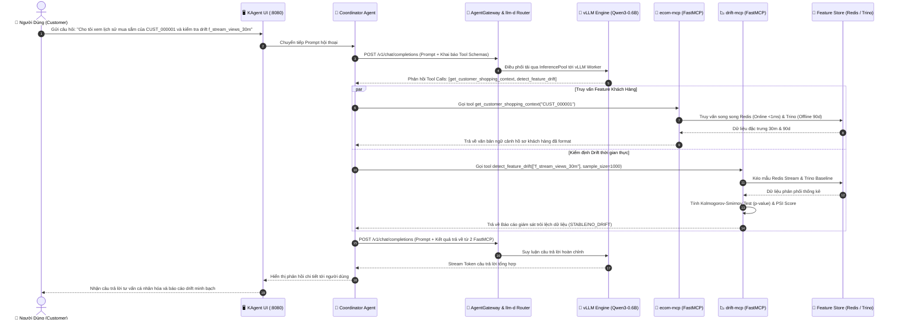

# 🤖 LLM Agent Architecture — KAgent / KMCP / llm-d / FastMCP / AgentRegistry

Tài liệu mô tả chi tiết kiến trúc **E-Commerce AI Agent System** được tái cấu trúc tinh gọn, độc lập và tối ưu hóa hiệu năng theo chuẩn **Kubernetes-native**:

- **KAgent** (`kagent.dev`) — Kubernetes CRD khai báo và quản lý AI Agents.
- **FastMCP (KMCP)** — Triển khai công cụ theo Model Context Protocol trực tiếp kết nối Feature Store (Redis/Trino) và Engine Drift Detection (KS-test/PSI), loại bỏ hoàn toàn các tầng Web API trung gian.
- **llm-d + Helm Router** — Nền tảng tự phục vụ LLM (vLLM Qwen3-0.6B) tối ưu hóa CPU/GPU với Router Gateway & InferencePool phân tải.
- **AgentRegistry** (`aregistry.ai`) — Agent Catalog & Governance platform.

---

## 🏗️ 1. Sơ Đồ Kiến Trúc Hệ Thống (System Deployment Architecture)

```
                                 ┌─────────────────────────────────┐
                                 │       End User / Customer       │
                                 └────────────────┬────────────────┘
                                                  │ (1) Chat qua kagent-ui (Port 8080)
                                                  ▼
                                 ┌─────────────────────────────────┐
                                 │     kagent-ui (Port 8080)       │
                                 │       KAgent Web Interface      │
                                 └────────────────┬────────────────┘
                                                  │ (2) Định tuyến tới Agent CRD
                                                  ▼
                        ┌─────────────────────────────────────────────────┐
                        │              KAgent Controller                  │
                        │   (Quản lý Declarative Agent CRD trong kagent)  │
                        └───────┬──────────────────┬──────────────────────┘
                                │                  │
             ┌──────────────────┤                  ├──────────────────┐
             ▼                  ▼                  ▼                  │
    ┌────────────────┐ ┌────────────────┐ ┌────────────────┐         │
    │  ecom-agent    │ │  drift-agent   │ │coordinator-agent│        │
    │  (Agent CRD)   │ │  (Agent CRD)   │ │  (Master Agent)│        │
    └───────┬────────┘ └───────┬────────┘ └───────┬─────────┘        │
            │                  │                  │                   │
            │ (MCP Protocol)   │ (MCP Protocol)   │ (Đa MCP Tools)   │
            ▼                  ▼                  ▼                   │
    ┌────────────────┐ ┌────────────────┐ ┌───────────────────┐      │
    │  ecom-mcp      │ │  drift-mcp     │ │  ecom-mcp +       │      │
    │ (MCPServer CRD)│ │ (MCPServer CRD)│ │  drift-mcp        │      │
    └───────┬────────┘ └───────┬────────┘ └───────────────────┘      │
            │                  │                                      │
            │ (Kết nối thẳng)  │ (Tính KS-test & PSI trực tiếp)      │
            ├──────────────────┼─────────────────┐                    │
            ▼                  ▼                 ▼                    │
     ┌──────────────┐   ┌──────────────┐   ┌──────────────┐   ┌────────────────────────┐
     │ Redis Online │   │ Trino Engine │   │ RAG Policy   │   │ ModelConfig CRD        │
     │ (<1ms Store) │   │ (Delta Lake) │   │ Knowledge    │   │ (llm-d / Qwen3-0.6B)   │
     └──────────────┘   └──────────────┘   └──────────────┘   └──────────┬─────────────┘
                                                                         │
                                                                         ▼
                                                              ┌────────────────────────┐
                                                              │ AgentGateway Routing   │
                                                              │ (HTTPRoute /v1/chat)   │
                                                              └──────────┬─────────────┘
                                                                         │
                                                                         ▼
                                                              ┌────────────────────────┐
                                                              │ llm-d Helm Router      │
                                                              │ (InferencePool LoadBal)│
                                                              └──────────┬─────────────┘
                                                                         │
                                                                         ▼
                                                              ┌────────────────────────┐
                                                              │ vLLM Workers (CPU/GPU) │
                                                              │ (Qwen3-0.6B serving)   │
                                                              └────────────────────────┘
```

---

## 🔄 2. Sơ Đồ Luồng Hoạt Động (Sequence & Activity Flow Diagram)

Quy trình xử lý một yêu cầu hội thoại hoàn chỉnh từ người dùng đến khi AI Agent hoàn tất trả lời:



---

## 🔑 3. Các Thành Phần Chính Đã Được Tinh Gọn (Core Components)

### 3.1. FastMCP Servers (Tích Hợp Trực Tiếp, Không Cần Web API)

Toàn bộ logic kết nối database và tính toán thống kê được tích hợp nội hàm vào 2 FastMCP servers:

| FastMCP Server | File Mã Nguồn | FastMCP Tools Cung Cấp | Hạ Tầng Tương Tác Trực Tiếp |
|:---|:---|:---|:---|
| **ecom-mcp** | [agentic_ai/ecom-mcp/server.py](file:///home/nhan/Projects/final_coursework/final_llm_agent/agentic_ai/ecom-mcp/server.py) | `get_customer_shopping_context`<br>`get_trending_products_analytics`<br>`search_rag_knowledge`<br>`get_rag_knowledge_chunk`<br>`health_check` | • Redis Online Store (chìa khóa `feat_stream:*`, `feat_rag_chunks:*`)<br>• Trino Engine (Catalog `delta.gold`) |
| **drift-mcp** | [agentic_ai/drift-mcp/server.py](file:///home/nhan/Projects/final_coursework/final_llm_agent/agentic_ai/drift-mcp/server.py) | `detect_feature_drift`<br>`get_drift_metrics`<br>`health_check` | • Redis Real-Time Stream (Mẫu phân phối hiện tại)<br>• Trino Delta Lake Gold Layer (Phân phối Baseline)<br>• SciPy & NumPy (Tính KS-test & PSI trực tiếp) |

### 3.2. KAgent Declarative Agents (Kubernetes CRD)

| Agent | YAML CRD | Tools Gắn Kèm | Chức Năng |
|:---|:---|:---|:---|
| **ecom-agent** | [agentic_ai/ecom-mcp/deployments/agent.yaml](file:///home/nhan/Projects/final_coursework/final_llm_agent/agentic_ai/ecom-mcp/deployments/agent.yaml) | `ecom-mcp` | Tư vấn mua sắm cá nhân hóa, gợi ý sản phẩm |
| **drift-agent** | [agentic_ai/drift-mcp/deployments/agent.yaml](file:///home/nhan/Projects/final_coursework/final_llm_agent/agentic_ai/drift-mcp/deployments/agent.yaml) | `drift-mcp` | Tự động giám sát chất lượng dữ liệu stream |
| **coordinator-agent** | [agentic_ai/coordinator-agent/deployments/agent.yaml](file:///home/nhan/Projects/final_coursework/final_llm_agent/agentic_ai/coordinator-agent/deployments/agent.yaml) | `ecom-mcp` + `drift-mcp` | Master Agent tổng hợp, điều phối đa nhiệm |

### 3.3. Model Serving Platform (llm-d + AgentGateway + Helm Router)

- **Model:** `Qwen/Qwen3-0.6B` (Chạy CPU/GPU nhẹ, không yêu cầu Hugging Face Gated Secret).
- **Router:** Cài đặt bằng Helm Chart `oci://ghcr.io/llm-d/charts/llm-d-router-gateway`.
- **InferencePool:** Phân phối tải suy luận tới các vLLM Pods decode/prefill độc lập.
- **AgentGateway:** Quản lý `HTTPRoute` theo chuẩn Gateway API, áp dụng chính sách Rate Limiting và Tracing Spans.

---

## 🧪 4. 5 Lớp & Hàm Cốt Lõi (5 Key Classes / Handlers)

1. **`CustomerFeatureResponse` (Pydantic V2 Schema)**
   - Vị trí: [agentic_ai/ecom-mcp/server.py](file:///home/nhan/Projects/final_coursework/final_llm_agent/agentic_ai/ecom-mcp/server.py)
   - Kiểm định cấu trúc hợp nhất dữ liệu thời gian thực (Redis) và lịch sử (Delta Lake).

2. **`get_customer_shopping_context(customer_id: str)` (FastMCP Tool Handler)**
   - Vị trí: [agentic_ai/ecom-mcp/server.py](file:///home/nhan/Projects/final_coursework/final_llm_agent/agentic_ai/ecom-mcp/server.py)
   - Tự động rút trích và tổng hợp hồ sơ khách hàng thành báo cáo văn bản ngắn gọn, trực quan cho LLM suy luận.

3. **`calculate_psi(baseline, current, num_bins=10)` (Statistical Function)**
   - Vị trí: [agentic_ai/drift-mcp/server.py](file:///home/nhan/Projects/final_coursework/final_llm_agent/agentic_ai/drift-mcp/server.py)
   - Tính toán chỉ số ổn định phân phối dân số (Population Stability Index) qua NumPy với ngưỡng cảnh báo drift `PSI > 0.25`.

4. **`detect_feature_drift(features, sample_size)` (FastMCP Tool Handler)**
   - Vị trí: [agentic_ai/drift-mcp/server.py](file:///home/nhan/Projects/final_coursework/final_llm_agent/agentic_ai/drift-mcp/server.py)
   - Thực thi đồng thời kiểm định 2 mẫu Kolmogorov-Smirnov (`scipy.stats.ks_2samp`) và PSI score, cung cấp cơ chế Resilience Fallback khi ngắt kết nối hạ tầng.

5. **`trace_span(span_name, attributes)` (OpenTelemetry Telemetry Helper)**
   - Vị trí: [agentic_ai/ecom-mcp/telemetry.py](file:///home/nhan/Projects/final_coursework/final_llm_agent/agentic_ai/ecom-mcp/telemetry.py) & [agentic_ai/drift-mcp/telemetry.py](file:///home/nhan/Projects/final_coursework/final_llm_agent/agentic_ai/drift-mcp/telemetry.py)
   - Tự động đính kèm Distributed Tracing spans cho từng thao tác truy vấn database, xuất dữ liệu sang OpenTelemetry Collector / Jaeger.
