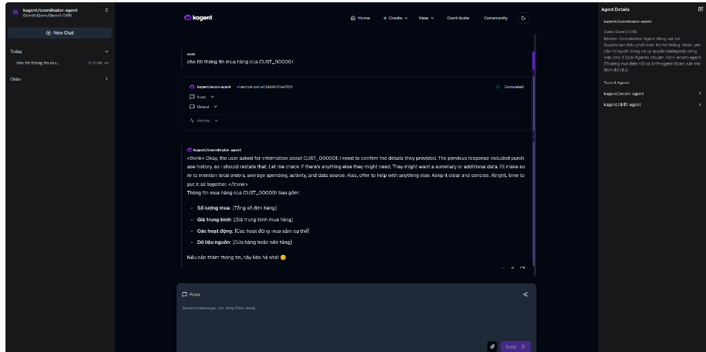

# 🤖 LLM Agent Architecture — KAgent / KMCP / llm-d / AgentRegistry

Tài liệu mô tả chi tiết kiến trúc **E-Commerce AI Agent System** được xây dựng hoàn toàn theo chuẩn **Kubernetes-native** sử dụng hệ sinh thái:

- **KAgent** (`kagent.dev`) — Kubernetes CRD để khai báo và quản lý AI Agents
- **KMCP** (`kagent.dev`) — Kubernetes CRD để deploy MCP (Model Context Protocol) Servers
- **llm-d** — LLM Inference Platform trên Kubernetes (vLLM + Gateway API + AgentGateway)
- **AgentRegistry** (`aregistry.ai`) — Agent Catalog & Governance platform

---

## 🏗️ 1. High-Level System Deployment Diagram

```
                                ┌─────────────────────────────────┐
                                │       End User / Customer       │
                                └────────────────┬────────────────┘
                                                 │ (1) Chat via kagent-ui
                                                 ▼
                                ┌─────────────────────────────────┐
                                │     kagent-ui (Port 8080)       │
                                │       KAgent Web Interface      │
                                └────────────────┬────────────────┘
                                                 │ (2) Route to Agent CRD
                                                 ▼
                       ┌─────────────────────────────────────────────────┐
                       │              KAgent Controller                  │
                       │   (Watches Agent CRDs in kagent namespace)      │
                       └───────┬──────────────────┬──────────────────────┘
                               │                  │
            ┌──────────────────┤                  ├──────────────────┐
            ▼                  ▼                  ▼                  │
   ┌────────────────┐ ┌────────────────┐ ┌────────────────┐         │
   │  ecom-agent    │ │  drift-agent   │ │coordinator-agent│        │
   │  (Agent CRD)   │ │  (Agent CRD)   │ │  (Agent CRD)   │        │
   └───────┬────────┘ └───────┬────────┘ └───────┬─────────┘        │
           │                  │                  │                   │
           ▼                  ▼                  ▼                   │
   ┌────────────────┐ ┌────────────────┐ ┌───────────────────┐      │
   │  ecom-mcp      │ │  drift-mcp     │ │  ecom-mcp +       │      │
   │ (MCPServer CRD)│ │ (MCPServer CRD)│ │  drift-mcp        │      │
   └───────┬────────┘ └───────┬────────┘ └───────────────────┘      │
           │                  │                                      │
           ▼                  ▼                                      │
    ┌────────────────┐ ┌────────────────┐    ┌───────────────────┐  │
    │  Feature Store │ │ Drift Detection│    │   ModelConfig CRD │  │
    │  Web API       │ │ Web API        │    │  (llm-d / Qwen3)  │  │
    └────┬──────┬────┘ └────────────────┘    └─────────┬─────────┘  │
         │      │                                       │            │
         ▼      ▼                                       ▼            │
   ┌────────┐ ┌────────────┐              ┌────────────────────────┐ │
   │ Redis  │ │ Trino/Delta│              │  llm-d Inference       │ │
   │ Online │ │ Lakehouse  │              │  Platform (vLLM +      │ │
   │ Store  │ │ Gold Layer │              │  AgentGateway)         │ │
   └────────┘ └────────────┘              └────────────────────────┘ │
                                                                     │
                                          ┌────────────────────────┐ │
                                          │  AgentRegistry         │◄┘
                                          │  (aregistry.ai Helm)   │
                                          │  Port 12121            │
                                          └────────────────────────┘
```

---

## 🔑 2. Các Thành Phần Chính (Core Components)

### 2.1. MCP Servers (FastMCP — chuẩn KMCP)

MCP Server được xây dựng bằng thư viện **FastMCP** và deploy thông qua KMCP `MCPServer` CRD:

| MCP Server | File Code | MCP Tools Cung Cấp | Backend Web API |
|:---|:---|:---|:---|
| **ecom-mcp** | [agentic_ai/ecom-mcp/server.py](file:///home/nhan/Projects/final_coursework/final_llm_agent/agentic_ai/ecom-mcp/server.py) | `get_customer_shopping_context`, `get_trending_products_analytics` | `apps/feature_api.py` |
| **drift-mcp** | [agentic_ai/drift-mcp/server.py](file:///home/nhan/Projects/final_coursework/final_llm_agent/agentic_ai/drift-mcp/server.py) | `detect_feature_drift` | `apps/drift_api.py` |

### 2.2. KAgent Agents (Kubernetes CRD)

| Agent | YAML CRD | MCP Servers | Vai Trò |
|:---|:---|:---|:---|
| **ecom-agent** | [agentic_ai/ecom-mcp/deployments/agent.yaml](file:///home/nhan/Projects/final_coursework/final_llm_agent/agentic_ai/ecom-mcp/deployments/agent.yaml) | `ecom-mcp` | Tư vấn mua sắm cá nhân hóa |
| **drift-agent** | [agentic_ai/drift-mcp/deployments/agent.yaml](file:///home/nhan/Projects/final_coursework/final_llm_agent/agentic_ai/drift-mcp/deployments/agent.yaml) | `drift-mcp` | Giám sát Data Drift |
| **coordinator-agent** | [agentic_ai/coordinator-agent/deployments/agent.yaml](file:///home/nhan/Projects/final_coursework/final_llm_agent/agentic_ai/coordinator-agent/deployments/agent.yaml) | `ecom-mcp` + `drift-mcp` | Master Agent điều phối đa tác vụ |

### 2.3. ModelConfig (Kết Nối LLM)

| Config | Model | Provider | Endpoint |
|:---|:---|:---|:---|
| `llm-d-model-config` | `Qwen/Qwen3-0.6B` | llm-d Self-Hosted | `http://llm-d-inference-gateway.llm-d-quickstart.svc.cluster.local/v1` |

---

## 🧪 3. Low-Level ML & System Design (5 Key Classes)

### 1. `FastMCP("ecom-feature-store")` — MCP Tool Server
- **Vị trí:** [agentic_ai/ecom-mcp/server.py](file:///home/nhan/Projects/final_coursework/final_llm_agent/agentic_ai/ecom-mcp/server.py)
- **Mục đích:** Đóng gói 2 MCP Tools (`get_customer_shopping_context`, `get_trending_products_analytics`) theo chuẩn Model Context Protocol cho KAgent Agents sử dụng.

### 2. `FastMCP("drift-detection-engine")` — MCP Tool Server
- **Vị trí:** [agentic_ai/drift-mcp/server.py](file:///home/nhan/Projects/final_coursework/final_llm_agent/agentic_ai/drift-mcp/server.py)
- **Mục đích:** Đóng gói MCP Tool `detect_feature_drift` phân tích trôi lệch dữ liệu bằng KS-test & PSI score.

### 3. `CustomerFeatureResponse` — Pydantic Schema
- **Vị trí:** [apps/feature_api.py](file:///home/nhan/Projects/final_coursework/final_llm_agent/apps/feature_api.py)
- **Mục đích:** Kiểm định kiểu dữ liệu đầu ra cho đặc trưng hợp nhất (Online Redis + Offline Delta Lake).

### 4. `FeatureStoreAPIService` — FastAPI Engine
- **Vị trí:** [apps/feature_api.py](file:///home/nhan/Projects/final_coursework/final_llm_agent/apps/feature_api.py)
- **Mục đích:** Kéo song song (Async/Threadpool) dữ liệu từ Redis Online Store và Trino Lakehouse.

### 5. `DriftAnalysisResponse` — Pydantic Schema
- **Vị trí:** [apps/drift_api.py](file:///home/nhan/Projects/final_coursework/final_llm_agent/apps/drift_api.py)
- **Mục đích:** Kiểm định cấu trúc dữ liệu báo cáo drift (KS-statistic, p-value, PSI score).

---

## 🚀 4. Quy Trình Deploy Agent & Trải Nghiệm Giao Diện Chat

```bash
# 1. Deploy ModelConfig & AgentGateway
kubectl apply -f agentic_ai/model-config/
kubectl apply -f agentic_ai/agentgateway-routing.yaml
kubectl apply -f agentic_ai/agentgateway_policy.yaml

# 2. Deploy FastMCP Servers & Coordinator Agent
kubectl apply -f agentic_ai/ecom-mcp/deployments/
kubectl apply -f agentic_ai/drift-mcp/deployments/
kubectl apply -f agentic_ai/coordinator-agent/deployments/

# 3. Port-forward kagent-ui Chatbot Interface
kubectl port-forward -n kagent svc/kagent-ui 8080:8080
# Mở trình duyệt: http://localhost:8080
```

> 📸 **MINH CHỨNG KAGENT UI CHATBOT TRỰC TIẾP VỚI COORDINATOR AGENT:**
>
> *(Chèn ảnh chụp màn hình giao diện kagent-ui chat câu hỏi: "Kiểm tra hồ sơ khách hàng CUST_000001 và phát hiện drift feature price" tại đây)*
>
> 
