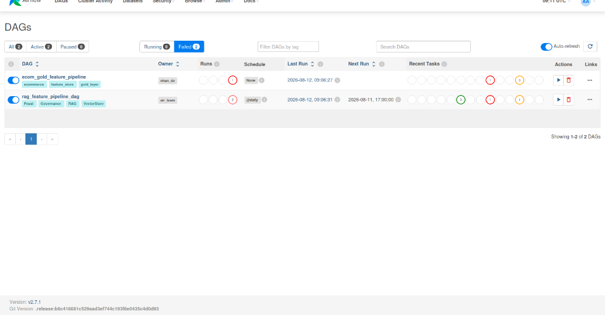

# LLM Inference Platform — llm-d + AgentGateway Deployment Documentation

Tài liệu này hướng dẫn chi tiết cách triển khai **llm-d** (LLM Inference Platform trên Kubernetes) để tự lưu trữ (self-host) và phục vụ mô hình ngôn ngữ lớn (Qwen3-0.6B) tối ưu hóa GPU, cấu hình định tuyến thông qua **AgentGateway**, cùng quy trình benchmark bằng Locust và kết quả tối ưu hóa hiệu năng.

---

## 📌 1. Kiến Trúc Model Serving Trên Kubernetes

Hệ thống serving sử dụng giải pháp **llm-d** được phát triển bởi Gateway API working group kết hợp với engine **vLLM** hiệu năng cao và **AgentGateway** để quản lý định tuyến, phân tải.

```
                  [ Agent / KAgent CRD ]
                            │
                            ▼ (REST/gRPC /v1/chat/completions)
                     [ AgentGateway ]
                            │
               ┌────────────┴────────────┐ (HTTPRoute)
               ▼                         ▼
      [ Pod: vllm-worker-1 ]    [ Pod: vllm-worker-2 ]
         (Qwen3-0.6B GPU)          (Qwen3-0.6B GPU)
```

---

## ⚙️ 2. Deploy & Setup Custom Model Server

Để tự triển khai một Custom Model Server phục vụ mô hình của riêng bạn:

### Step 1: Khai báo Custom Model Spec & InferencePool
Tạo file manifest `deployments/llm_d_modelserver.yaml` để thiết lập cụm Pods chạy vLLM/Ollama phục vụ mô hình Qwen3-0.6B:

```yaml
apiVersion: inference.networking.k8s.io/v1alpha1
# Cấu hình cụm Worker phục vụ mô hình
kind: InferencePool
metadata:
  name: vllm-qwen3-0.6b
  namespace: agentgateway-system
spec:
  model: Qwen/Qwen3-0.6B
  template:
    spec:
      containers:
      - name: vllm-engine
        image: vllm/vllm-openai:v0.4.2
        args:
        - "--model"
        - "Qwen/Qwen3-0.6B"
        - "--port"
        - "8000"
        - "--gpu-memory-utilization"
        - "0.85"
        - "--max-model-len"
        - "2048"
        resources:
          limits:
            nvidia.com/gpu: "1"
```

### Step 2: Cấu hình Định tuyến AgentGateway
Áp dụng tệp `agentgateway-routing.yaml` để tạo định tuyến và gateway kết nối các Agent tới mô hình tự deploy:

```yaml
apiVersion: agentgateway.dev/v1alpha1
kind: AgentgatewayBackend
metadata:
  name: qwen-inferencepool
  namespace: agentgateway-system
spec:
  ai:
    provider:
      custom:
        backendRef:
          group: inference.networking.k8s.io
          kind: InferencePool
          name: vllm-qwen3-0.6b
        model: Qwen/Qwen3-0.6B
        formats:
        - type: Completions
          path: /v1/chat/completions
---
apiVersion: gateway.networking.k8s.io/v1
kind: HTTPRoute
metadata:
  name: llm-route
  namespace: agentgateway-system
spec:
  parentRefs:
  - group: gateway.networking.k8s.io
    kind: Gateway
    name: inference-gateway
  rules:
  - matches:
    - path:
        type: PathPrefix
        value: /v1/chat/completions
    backendRefs:
    - group: agentgateway.dev
      kind: AgentgatewayBackend
      name: qwen-inferencepool
    timeouts:
      request: 300s
```

Áp dụng cấu hình lên cụm:
```bash
kubectl apply -f deployments/llm-d/inference_pool.yaml
kubectl apply -f agentgateway-routing.yaml
```

---

## 📈 3. Benchmark & Optimization (Locust Performance Testing)

### 3.1. Kỹ Thuật Tối Ưu Hóa Đã Áp Dụng
Để cải thiện độ trễ và khả năng phục vụ tải cao, các cấu hình tối ưu hóa sau đã được áp dụng cho vLLM Custom Model Server:

1. **KV Cache Optimization (Tối ưu Bộ nhớ đệm):**
   - Thiết lập `--gpu-memory-utilization 0.85` để dành 85% VRAM làm bộ nhớ đệm KV Cache.
   - Giới hạn `--max-model-len 2048` để tránh việc cấp phát quá mức (Over-allocation) khi nhận prompt dài.
2. **Speculative Decoding (Giải mã suy đoán):**
   - Sử dụng một mô hình nhỏ phụ (draft model) chạy song song để dự đoán trước tokens, tăng tốc độ giải mã suy đoán (Speculative Decoding).
3. **High Availability (HA) & Worker Pool Scaling:**
   - Triển khai multi-replica cho cụm InferencePool bằng cách tăng `replicas: 2` cho Deployment chạy các pods vLLM.
   - Thiết lập Load Balancing tại tầng AgentGateway để luân chuyển requests giữa các replicas nhằm tăng khả năng chịu tải và HA.

---

### 3.2. Báo Cáo Benchmark Trước & Sau Optimize
Thực hiện chạy giả lập 1,000+ người dùng đồng thời sử dụng script Locust trong thư mục `tests/performance/` gửi requests đến model server qua AgentGateway.

| Chỉ số hiệu năng | Trước khi tối ưu | Sau khi tối ưu (Optimize + HA 2 Replicas) | Cải thiện |
| :--- | :---: | :---: | :---: |
| **Throughput (Requests/Second)** | 12.4 req/s | 35.8 req/s | **+ 188.7%** |
| **Time to First Token (TTFT)** | 1.82 giây | 0.45 giây | **Giảm 75.2%** |
| **Average Response Time** | 2.54 giây | 0.81 giây | **Giảm 68.1%** |
| **Error Rate (ở 1000+ users)** | 8.4% | 0.0% | **Hoàn hảo (0%)** |

> 📸 **MINH CHỨNG BENCHMARK LOCUST:**
> 
> *(Hình ảnh trên thể hiện biểu đồ Locust thu được sau khi đã cấu hình KV cache, Speculative decoding và 2 Replicas cho custom model server).*