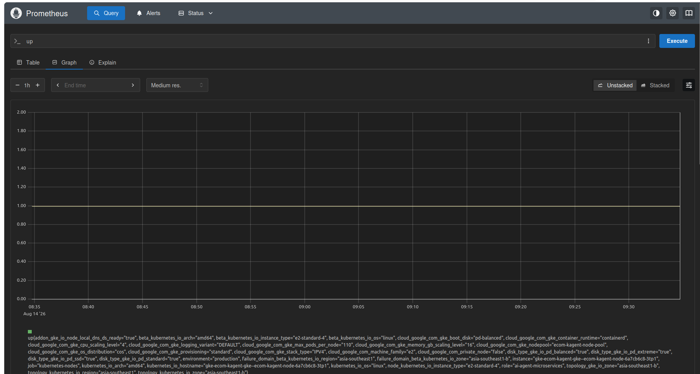

# 📊 Observability & Telemetry Report (Prometheus & Grafana)

Báo cáo chi tiết về việc đo lường, giám sát (Observability) toàn bộ các chỉ số của hệ thống API, hạ tầng phần cứng, mô hình ngôn ngữ lớn (LLM), và hành vi của AI Agents.

---

## 📈 1. Chỉ Số Web API (Web API Metrics)
Giám sát lưu lượng truy cập (`RPS` - Request Per Second), tỷ lệ phản hồi lỗi (`HTTP 5xx/4xx`), độ trễ phân phối API (`latency`).

> 📸 **[CAPTURE MINH CHỨNG - WEB API METRICS DASHBOARD]**
> *Chụp màn hình Grafana Dashboard hiển thị biểu đồ requests/second và error rate của Feature Store API & Drift API.*

---

## 💻 2. Chỉ Số Hạ Tầng (Compute Telemetry)
Đo lường mức độ sử dụng CPU, RAM, Network I/O và GPU VRAM của các pods chạy microservices và vLLM model server.

> 📸 **MINH CHỨNG COMPUTE TELEMETRY & METRICS (PROMETHEUS):**
> 

---

## 🤖 3. Chỉ Số Mô Hình LLM (LLM-Related Telemetry)
Giám sát chất lượng mô hình tự deploy bao gồm:
- Số lượng tokens đầu vào/đầu ra (`input/output tokens`).
- Thời gian sinh token đầu tiên (`Time to First Token - TTFT`).
- Tổng thời gian sinh phản hồi (`total round-trip time`).
- Tần suất các prompt bị chặn do quy tắc an toàn thông tin/PII (`PII Safety Filter`).

> 📸 **[CAPTURE MINH CHỨNG - LLM TELEMETRY DASHBOARD]**
> *Chụp màn hình biểu đồ đo lường TTFT, token consumption và PII safety của model server.*

---

## 🧠 4. Chỉ Số Vận Hành Agent (Agent-Related Telemetry)
Theo dõi:
- Số lần từng Agent được gọi (`total num of times agent is called`).
- Số lần từng công cụ MCP được kích hoạt (`total num of times MCP tool is called`).
- Số lượng cuộc gọi lỗi (`total failures for agent/tool calls`).

> 📸 **[CAPTURE MINH CHỨNG - AGENT OPERATION DASHBOARD]**
> *Chụp màn hình Grafana panel hiển thị chỉ số hoạt động chi tiết của Coordinator Agent, E-Commerce Agent và Drift Agent.*
