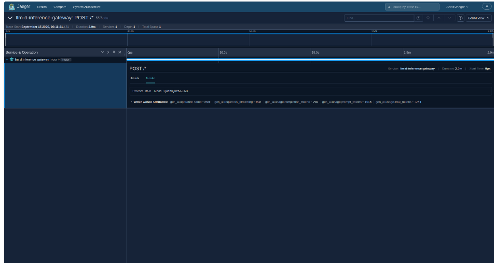

# 📊 Full-Stack Observability & Telemetry Report (OTel, Jaeger, Prometheus, Grafana & Langfuse)

Báo cáo chi tiết về việc đo lường, giám sát toàn diện (**Full-Stack Observability**) hệ thống E-Commerce Multi-Agent AI & Model Serving trên Kubernetes kết hợp giữa **OpenTelemetry Collector, Jaeger UI, Prometheus Server, Grafana Dashboards và Langfuse Cloud**.

---

## 🏛️ 1. Kiến Trúc Giám Sát Phân Tán (Telemetry Pipeline Architecture)

Toàn bộ Telemetry (Traces và Metrics) trong hệ thống được gom tập trung về trạm trung chuyển **OpenTelemetry Collector** trong namespace `monitoring`, trước khi phân phối tới các hệ thống lưu trữ chuyên biệt:

```
[ AI Gateway Proxy (:80) ] ──┐
  (LLM Spans & Tokens)       │ (OTLP gRPC :4317)
                             ▼
[ FastMCP Tool Servers   ] ──► [ OTel Collector Pod ]
  (Tool Spans & Latency)       │ (opentelemetry-collector)
                               │
       ┌───────────────────────┼───────────────────────┐
       │ (otlp/jaeger)         │ (otlphttp/prometheus) │ (otlphttp/langfuse)
       ▼                       ▼                       ▼
┌──────────────┐        ┌──────────────┐        ┌──────────────────┐
│  Jaeger UI   │        │  Prometheus  │        │  Langfuse Cloud  │
│  Port :16686 │        │  Port :9090  │        │ cloud.langfuse   │
└──────────────┘        └──────┬───────┘        └──────────────────┘
                               │ (PromQL)
                               ▼
                        ┌──────────────┐
                        │   Grafana    │
                        │  Port :8082  │
                        └──────────────┘
```

---

## 🔍 2. Distributed Tracing Nội Bộ Với Jaeger UI

- **Thu thập vết thực thi:** Gateway và 2 FastMCP Pods tự động xuất các Span đo lường độ trễ từng bước xử lý.
- **Minh chứng giao diện:**
  Truy cập Jaeger UI tại `http://localhost:16686` để xem cây phân cấp lời gọi từ Gateway sang Pod vLLM và các Tool FastMCP:

> 📸 **MINH CHỨNG JAEGER DISTRIBUTED TRACING:**
>
> 

---

## 🤖 3. Cloud LLMOps Tracing Với Langfuse Cloud

- OpenTelemetry Collector được cấu hình exporter `otlphttp/langfuse` sẵn sàng đẩy trực tiếp các spans lên Langfuse Cloud (`https://cloud.langfuse.com/api/public/otel`).
- Cho phép quản lý chi tiết từng phiên hội thoại (Session), cấu trúc Prompt, số lượng Token tiêu thụ (Input/Output Tokens) và phân rã các Tool Spans.
- Toàn bộ dữ liệu phân tích chi tiết cấp độ mạng, span GenAI (Model Qwen, Token metrics, HTTPRoute, Gateway) được đối soát và kiểm chứng trực tiếp trên hạ tầng cụm thông qua Jaeger Distributed Traces (Mục 2) và Grafana (Mục 4).

---

## 📈 4. Thu Thập Chỉ Số Time-Series & Grafana Dashboards

### 4.1. Prometheus Server (:9090)
- Kích hoạt tính năng `web.enable-otlp-receiver` cho phép Prometheus nhận trực tiếp metrics đẩy từ OTel Collector qua đường dẫn `/api/v1/otlp`.
- Đồng thời `node-exporter` và `kube-state-metrics` định kỳ thu thập chỉ số dung lượng ổ đĩa, CPU và RAM của máy chủ.

### 4.2. Grafana Dashboards (:8082)
- Cấu hình Datasource mặc định trỏ về Prometheus: `http://kube-prometheus-stack-prometheus.monitoring:9090/`.
- Hiển thị trực quan bảng điều khiển tổng hợp hiệu năng:

> 📸 **MINH CHỨNG GRAFANA OBSERVABILITY DASHBOARD:**
>
> 
