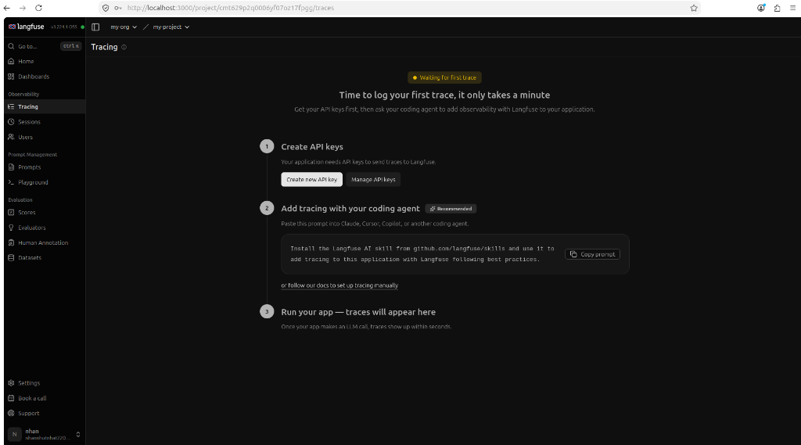
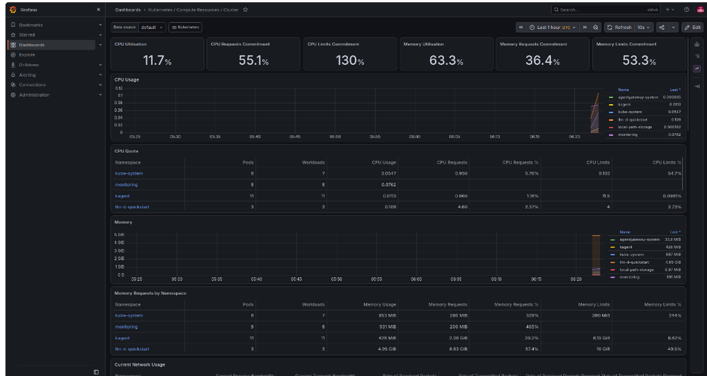

# 📊 Observability & Telemetry Report (Prometheus, Grafana & Langfuse)

Báo cáo chi tiết về việc đo lường, giám sát toàn diện (**Full-Stack Observability**) hệ thống E-Commerce MLOps & LLM Agent trên Kubernetes bằng **Prometheus, Grafana, OpenTelemetry Collector, và Langfuse**.

---

## 📈 1. Chỉ Số Web API (Web API Metrics)

Giám sát lưu lượng truy cập (`RPS` - Request Per Second), tỷ lệ phản hồi lỗi (`HTTP 5xx / 4xx`), và độ trễ phân phối (`latency quantiles`) của Feature Store API & Drift API.

### Các Metrics Thu Thập:
- `http_requests_total{method, endpoint, status}`: Tổng số lượt requests nhận được theo từng endpoint và mã trạng thái.
- `http_request_duration_seconds{method, endpoint}`: Histogram phân phối độ trễ xử lý (P50, P90, P95, P99).

### Các Truy Vấn PromQL Chủ Chốt:
```promql
# 1. Đo lường Request Rate (RPS) theo endpoint:
sum(rate(http_requests_total[1m])) by (endpoint)

# 2. Đo lường độ trễ P95 Latency của Web API:
histogram_quantile(0.95, sum(rate(http_request_duration_seconds_bucket[5m])) by (le, endpoint))

# 3. Tỷ lệ lỗi HTTP 5xx:
sum(rate(http_requests_total{status=~"5.."}[1m])) / sum(rate(http_requests_total[1m])) * 100
```

---

## 💻 2. Chỉ Số Hạ Tầng (Compute Telemetry)

Đo lường mức độ tiêu thụ tài nguyên phần cứng (CPU, Memory RAM, Network I/O) của các Pods chạy microservices, Redis, Trino, và vLLM model server.

### Các Chỉ Số Giám Sát:
- `container_cpu_usage_seconds_total`: Tỷ lệ sử dụng CPU của từng container.
- `container_memory_working_set_bytes`: Bộ nhớ RAM thực tế đang chiếm dụng.
- `container_network_receive_bytes_total` & `container_network_transmit_bytes_total`: Băng thông mạng I/O.

> 📸 **MINH CHỨNG PROMETHEUS TARGETS & METRICS:**
>
> *(Chèn ảnh chụp màn hình Prometheus Targets `http://localhost:9090/targets` hiển thị trạng thái UP của các endpoints)*
>
> 

---

## 🤖 3. Chỉ Số Mô Hình LLM & LLMOps (Langfuse & AgentGateway)

Theo dõi chất lượng vận hành, chi phí và hiệu năng của cụm Custom Model Server (vLLM Qwen3-0.6B / llm-d):
- **Token Consumption**: Số lượng tokens đầu vào (`gen_ai.request.prompt_tokens`) và tokens sinh ra (`gen_ai.response.completion_tokens`).
- **Time to First Token (TTFT)**: Thời gian từ lúc nhận prompt đến khi sinh ra token đầu tiên.
- **LLM Latency P90**: Thời gian xử lý toàn bộ phản hồi từ Model Server.
- **Agent Traces & Sessions**: Toàn bộ chuỗi hội thoại, prompt template, tool calling traces trên Langfuse UI.

```bash
# Port-forward giao diện Langfuse UI
kubectl port-forward -n monitoring svc/langfuse-web 3000:3000
# Truy cập: http://localhost:3000
```

> 📸 **MINH CHỨNG LANGFUSE LLMOPS TRACING:**
>
> *(Chèn ảnh chụp màn hình Langfuse UI hiển thị Trace chi tiết các câu chat, số lượng Prompt Tokens, Completion Tokens, Latency và Tool Calling)*
>
> 

---

## 🧠 4. Chỉ Số Vận Hành Agent & MCP Tools (Agent Telemetry)

Theo dõi hành vi và độ ổn định của hệ thống Multi-Agent và các công cụ FastMCP:
- **Tần suất gọi Agent (`total agent calls`)**: Số lần Coordinator Agent tiếp nhận yêu cầu từ người dùng.
- **Tần suất kích hoạt công cụ MCP (`mcp_tool_calls_total`)**: Số lượt kích hoạt `get_customer_shopping_context`, `get_trending_products_analytics`, `detect_feature_drift`.
- **Tỷ lệ lỗi công cụ (`mcp tool failures`)**: Tỷ lệ các cuộc gọi công cụ trả về trạng thái `error` hoặc bị timeout.
- **Thời gian thi hành công cụ (`mcp_tool_execution_duration_seconds`)**: Đo lường độ trễ khi MCP Tool truy xuất Redis Online Store và Trino Gold Layer.

### PromQL Giám Sát Agent & MCP:
```promql
# 1. Tần suất gọi từng MCP Tool:
sum(rate(mcp_tool_calls_total[1m])) by (tool_name)

# 2. Độ trễ thực thi MCP Tool P95:
histogram_quantile(0.95, sum(rate(mcp_tool_execution_duration_seconds_bucket[5m])) by (le, tool_name))
```

---

## 📊 5. Tích Hợp Grafana Dashboard Hoàn Chỉnh

Toàn bộ các nhóm chỉ số trên được đóng gói và hiển thị trực quan trong file cấu hình Grafana Dashboard: [observability/grafana_dashboards/agent_observability.json](file:///home/nhan/Projects/final_coursework/final_llm_agent/observability/grafana_dashboards/agent_observability.json).

```bash
# Port-forward để mở Grafana UI
kubectl port-forward -n monitoring svc/kube-prometheus-stack-grafana 8082:80
# Truy cập: http://localhost:8082
# Đăng nhập: User: admin | Password: prom-operator
```

Dashboard cung cấp chế độ xem thống nhất một cửa sổ (**Single-Pane-of-Glass**) gồm 5 Panels:
1. **Feature API Request Rate (RPS)**
2. **Feature API P95 Latency & Redis Cache Latency**
3. **Data Drift Detection PSI Rate & KS-Test Stat**
4. **LLM Inference Tokens & Latency**
5. **Agent & MCP Tool Call Success vs Failure Rate**

> 📸 **MINH CHỨNG GRAFANA DASHBOARD 5 PANELS:**
>
> *(Chèn ảnh chụp màn hình Grafana Dashboard hiển thị đầy đủ 5 biểu đồ thời gian thực tại đây)*
>
> 
