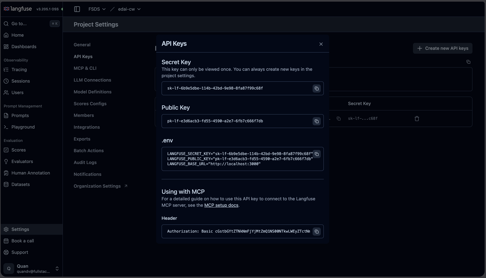

## Project Overview
Keep it short. Explain the purpose of your repository. Tell the reader who it is for.

Example:
This repository provides hands-on observability tutorials for the EDAI class. Students will learn how to deploy, configure, and manage a complete cloud-native observability stack—covering metrics, logs, traces, and LLM application tracing—using Kubernetes and Helm.


## Table of Contents
Add links to easily jump to different sections of your README.

Example:
- [Prerequisites](#prerequisites)
- [System Architecture](#system-architecture)
- [Repo Structure](#repo-structure)
- [Setup & Installation](#setup--installation)
  - [Install Otel Collector](#install-otel-collector)
  - [Install Elastic Search and Kibana for Logs](#install-elastic-search-and-kibana-for-logs)
  - [Install Jaeger for Traces](#install-jaeger-for-traces)
  - [Install Prometheus and Grafana for Metrics](#install-prometheus-and-grafana-for-metrics)
  - [Install Langfuse](#install-langfuse)
  - [Do Port-Forwarding](#do-port-forwarding)
- [Important Notes](#important-notes)
- [Troubleshooting & FAQ](#troubleshooting--faq)

## System Architecture
*Add a high-level description or a diagram here illustrating how your telemetry data flows from applications through the OpenTelemetry Collector into specific backend tools like Prometheus, Jaeger, ElasticSearch, and Langfuse.*

Tools: draw.io (often in industry), excalidraw (for blogs or tutorials because it's more beautiful?)

## Repo Structure
Show a folder tree so students know where to find things.

Example:
```text
.
├── helm_charts/
│   ├── kibana/
│   │   └── values.yaml
│   ├── langfuse/
│   │   └── values.yaml
│   └── otel/
│       └── values.yaml
├── imgs/
│   └── langfuse_api_keys.png
└── README.md
```

## Prerequisites
List all the tools and software a student needs before starting the tutorials (e.g., Python version, Docker, or specific accounts).

Example:
Before starting the tutorials, ensure you have the following tools installed and configured:
* **Kubernetes Cluster**: v1.26+ (e.g., Minikube, Kind, or EKS)
* **kubectl**: Configured to connect to your cluster
* **Helm**: v3.0+ installed
* **OpenSSL**: For generating secure deployment credentials

## Setup & Installation
Provide step-by-step instructions to get the project running on their computers.

### Install Otel Collector
https://opentelemetry.io/docs/platforms/kubernetes/helm/collector/
```bash
helm repo add open-telemetry https://open-telemetry.github.io/opentelemetry-helm-charts
k create ns monitoring
kubens monitoring
helm install opentelemetry-collector open-telemetry/opentelemetry-collector -f helm_charts/otel/values.yaml
```

AgentGateway also gives us a tutorial how to install Otel and integrate its, take a look at: https://agentgateway.dev/docs/kubernetes/latest/observability/otel-stack/

### Install Elastic Search and Kibana for Logs
Ref: https://github.com/elastic/cloud-on-k8s/tree/main/deploy/eck-stack/#installing-the-chart
```bash
helm repo add elastic https://helm.elastic.co && helm repo update
helm install elastic-operator elastic/eck-operator -n elastic-system --create-namespace
helm install elastic elastic/eck-stack -n monitoring -f helm_charts/kibana/values.yaml
```

### Install Jaeger for Traces
Ref: https://github.com/jaegertracing/helm-charts
```bash
helm repo add jaegertracing https://jaegertracing.github.io/helm-charts
helm install jaeger jaegertracing/jaeger
```

### Install Prometheus and Grafana for Metrics
Ref: https://github.com/prometheus-community/helm-charts/tree/main/charts/kube-prometheus-stack
```bash
helm repo add prometheus-community https://prometheus-community.github.io/helm-charts
helm install kube-prometheus-stack oci://ghcr.io/prometheus-community/charts/kube-prometheus-stack \
  --set prometheus.prometheusSpec.additionalArgs[0].name=web.enable-otlp-receiver \
  --set prometheus.prometheusSpec.additionalArgs[0].value="" \
  --set coreDns.enabled=false # Dont need coreDNS metrics
```

By default, Prometheus can only pull (scrape) metrics from other systems, adding `otlp-receiver` changes its behavior to accept incoming pushed data.

Another resource to guide you how to install things may interest you: https://oneuptime.com/blog/post/2026-01-17-helm-prometheus-grafana-deployment/view

### Install Langfuse

1. Create a Kubernetes secret
```bash
# Core secrets
kubectl create secret generic langfuse-secrets \
  -n monitoring \
  --from-literal=salt="$(openssl rand -base64 32)" \
  --from-literal=nextauthSecret="$(openssl rand -base64 32)" \
  --from-literal=encryptionKey="$(openssl rand -hex 32)" \
  --dry-run=client -o yaml | kubectl apply -f -

# PostgreSQL
kubectl create secret generic langfuse-postgresql-auth \
  -n monitoring \
  --from-literal=password="$(openssl rand -hex 24)" \
  --dry-run=client -o yaml | kubectl apply -f -

# ClickHouse
kubectl create secret generic langfuse-clickhouse-auth \
  -n monitoring \
  --from-literal=password="$(openssl rand -hex 24)" \
  --dry-run=client -o yaml | kubectl apply -f -

# Redis
kubectl create secret generic langfuse-redis-auth \
  -n monitoring \
  --from-literal=password="$(openssl rand -hex 24)" \
  --dry-run=client -o yaml | kubectl apply -f -

# S3/MinIO (root user + root password both required)
kubectl create secret generic langfuse-s3-auth \
  -n monitoring \
  --from-literal=rootUser="langfuse-admin" \
  --from-literal=rootPassword="$(openssl rand -base64 24)" \
  --dry-run=client -o yaml | kubectl apply -f -
```


2. Install
```bash
helm repo add langfuse https://langfuse.github.io/langfuse-k8s
helm install langfuse langfuse/langfuse -n monitoring -f helm_charts/langfuse/values.yaml
```

### Do port-forwarding

1. Grafana
```bash
k port-forward svc/kube-prometheus-stack-grafana 8082:80
```

Access Grafana at `localhost:8082` with username: `admin`, and password can be taken from the following command: `kubectl get secret --namespace monitoring kube-prometheus-stack-grafana -o jsonpath="{.data.admin-password}" | base64 --decode ; echo`

2. Prometheus
```bash
k port-forward svc/prometheus-operated 9090:9090
```
Access Prometheus at `localhost:9090`, try to do some queries:


3. Jaeger
```bash
k port-forward svc/jaeger 16686:16686
```
Access Jaeger at `localhost:16686`

4. Kinana
```bash
k port-forward svc/elastic-eck-kibana-kb-http 5601:5601 -n elastic-stack
```
Access Prometheus at `https://localhost:5601`, remember `HTTPS`!

Credentials:
- Username: `elastic`
- Password: Taken from the command `kubectl get secret elasticsearch-es-elastic-user -n monitoring -o jsonpath='{.data.elastic}' | base64 -d`

5. Langfuse
```bash
k port-forward svc/langfuse-web 3000:3000
```

+ Access `localhost:3000`, then create an username/password to sign in. It does not provide any default root/admin account as others.
+ Create an org and project name after you signed in. For example, FSDS and edai-cw, respectively.
+ Create an API key from your project setting as in the following image
   
+ Create langfuse-otel secret so that we can push trace from otel to langfuse
   ```bash
   kubectl create secret generic langfuse-otel-auth -n monitoring \
   --from-literal=basicAuth="$(printf '%s' 'pk-lf-e3d6acb3-fd55-4590-a2e7-6fb7c666f7db:sk-lf-6b9e5dbe-114b-42bd-9e98-8fa87f99c68f' | base64 -w0)" \
   --dry-run=client -o yaml | kubectl apply -f -
   ```
   Remember to change your API keys accordingly!
+ Upgrade the otel with langfuse
   ```bash
   helm upgrade --install opentelemetry-collector open-telemetry/opentelemetry-collector -f helm_charts/otel/values.yaml
   ```

### Important note!
- Since the Otel Collector is the one we send telemetry data to, always check it first if we can not receive any telemetrata at exporters!
- Remember, as I told you before, `helm repo add` should not be used in production, you should pull the code to your repo for versioning!
- Port forwarding is NOT good, expose via NGINX or other API Gateway!

## Troubleshooting & FAQ
List known issues or answers to common questions to help students fix bugs on their own.

Example:

#### Q: The OpenTelemetry Collector pods are in a `CrashLoopBackOff` state. How do I fix this?
* **A:** This is usually caused by indentation or syntax errors in your `values.yaml` file. Run the following command to check the configuration logs:
  ```bash
  kubectl logs deployment/opentelemetry-collector -n monitoring
  ```

#### Q: How can I verify that my secrets were created successfully before running Helm?
* **A:** You can list and inspect your generated secrets within the monitoring namespace by running:
  ```bash
  kubectl get secrets -n monitoring
  ```

## Future Work

Lists planned upgrades and future lab topics here.

Example:
* **Alerts**: Set up Slack notifications for system errors.
* **Persistent Storage**: Save metrics and logs on permanent cloud disks so data is not lost on restart.
