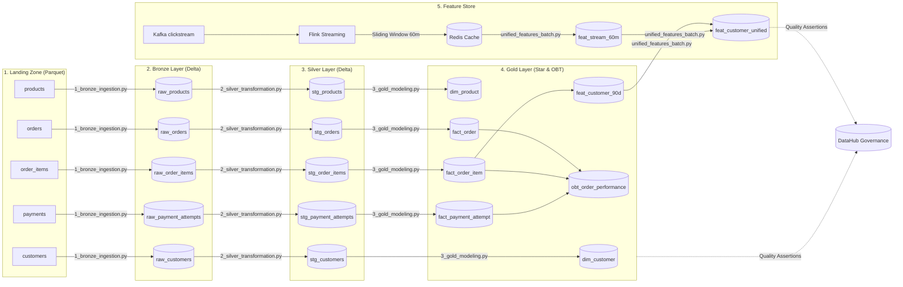

# E-commerce Medallion Lakehouse Pipeline & Feature Store (Mini-Coursework)

Dự án xây dựng hệ thống xử lý dữ liệu lớn (Lakehouse Architecture) hoàn chỉnh, quản lý luồng dữ liệu E-commerce từ Landing Zone qua các lớp Medallion (Bronze, Silver, Gold) và tích hợp Feature Store phục vụ mô hình học máy.

---

## 📑 Danh Mục Báo Cáo Kỹ Thuật

Tất cả báo cáo kỹ thuật chi tiết, chứng minh số liệu tối ưu và thiết kế schema được lưu trữ đầy đủ tại thư mục `docs/` của dự án chính:
1. **[Thiết Kế Schema & SCD Type 2](../final_llm_agent/docs/schema_design.md):** Giải trình mô hình Star Schema, OBT, quy ước đặt tên bảng và cơ chế SCD Type 2 / Point-in-Time Join.
2. **[Báo Cáo Tối Ưu Hóa Dữ Liệu & Storage](../final_llm_agent/docs/data_optimization.md):** Báo cáo chi tiết kỹ thuật Salting (Data Skew), Broadcast Join, `approx_count_distinct` (High Cardinality), Flink Watermark 45m & Deduplication, và Delta Compaction & Z-Ordering.

---

## 1. Công Nghệ Sử Dụng & Vai Trò (Technology Stack & Roles)

| Công Nghệ | Vai Trò & Chức Năng Cụ Thể |
| :--- | :--- |
| **MinIO** | Object Storage (tương tự AWS S3), lưu trữ toàn bộ dữ liệu của Lakehouse ở các tầng: Landing, Bronze, Silver và Gold. |
| **Delta Lake** | Định dạng bảng lưu trữ (Table Format) trên MinIO. Hỗ trợ giao dịch ACID, tối ưu hóa lưu vết lịch sử thay đổi (SCD Type 2) và ghi nhận schema của bảng. |
| **Apache Spark (PySpark)** | Công cụ tính toán phân tán. Chạy các tác vụ Batch processing chính: nạp dữ liệu từ Landing vào Bronze, làm sạch dữ liệu sang Silver, thực hiện Dimensional Modeling (PIT Join) sang Gold, và tính toán đặc trưng offline (Batch Features). |
| **Apache Kafka** | Nền tảng Message Queue/Streaming. Tiếp nhận luồng sự kiện clickstream (views, cart adds) thời gian thực từ hành vi khách hàng. |
| **Apache Flink (PyFlink)** | Engine xử lý luồng (Stream processing). Đọc clickstream liên tục từ Kafka, tính toán đặc trưng động sử dụng kỹ thuật Sliding Window 60 phút để đếm số lượt tương tác thời gian thực. |
| **Redis** | **Online Feature Store** (Bộ nhớ đệm tốc độ cao). Nhận đặc trưng thời gian thực từ Flink và cung cấp dữ liệu tức thì (độ trễ thấp < vài mili-giây) cho ứng dụng hoặc mô hình ML/Agent. |
| **Trino** | Engine truy vấn SQL phân tán. Kết nối Delta Lake thông qua Hive Metastore, cho phép chạy truy vấn SQL phân tích tốc độ cao và kiểm định dữ liệu (Data Quality Checks). |
| **Apache Airflow** | Hệ thống điều phối công việc (Orchestration). Lập lịch, quản lý luồng phụ thuộc tự động từ nạp dữ liệu, biến đổi đến cập nhật Feature Store. |
| **DataHub** | Cổng quản trị dữ liệu (Data Governance Portal). Quản lý Metadata, vẽ sơ đồ Lineage trực quan và giám sát các bài test chất lượng dữ liệu (Quality Assertions). |

---

## 2. Kiến Trúc Dữ Liệu Lớp Medallion & Feature Store

Hệ thống được tổ chức theo kiến trúc lớp Medallion tiêu chuẩn:



---

## 3. Thiết Kế Tầng Dữ Liệu Gold (Schema Design)

Tầng Gold được mô hình hóa theo mô hình hình sao **Star Schema** tối ưu hóa lưu trữ và mô hình **OBT (One Big Table)** tối ưu hóa truy vấn:

### 3.1. Star Schema (Mô hình chuẩn hóa)
* **Bảng chiều (Dimension Tables):** 
  * `dim_customer` (SCD Type 2): Lưu thông tin khách hàng, lưu trữ lịch sử chuyển đổi quốc gia/phân khúc. Cột hiệu lực `valid_from_ts` được đặt mặc định từ `1970-01-01 00:00:00` để đảm bảo khớp chính xác mọi đơn hàng lịch sử trong quá khứ (tránh lỗi dữ liệu thô bị lệch ngày đăng ký).
  * `dim_product` (SCD Type 2): Lưu thông tin sản phẩm và lịch sử đổi giá. Cột hiệu lực `valid_from_ts` được khởi tạo từ `1970-01-01 00:00:00` tương tự.
  * `dim_date`: Bảng chiều thời gian sinh tự động.
  * `dim_payment_method` & `dim_order_status`: Danh mục phương thức thanh toán và trạng thái đơn hàng.
* **Bảng sự kiện (Fact Tables):** 
  * `fact_order`: Doanh thu đơn hàng (gross, discount, net).
  * `fact_order_item`: Chi tiết từng mặt hàng. Sử dụng **Point-in-Time Join** (so khớp ngày mua hàng `order_ts` nằm giữa khoảng hiệu lực `[valid_from_ts, valid_to_ts]` của chiều tương ứng) để lấy chính xác Surrogate Key (`customer_key`, `product_key`).
  * `fact_payment_attempt`: Lịch sử các lần thực hiện thanh toán.

### 3.2. One Big Table (Bảng phẳng rộng OBT)
* **`obt_order_performance`**: Denormalize (bịt phẳng) toàn bộ thông tin Fact và Dimension, giúp các công cụ BI (như Superset, Tableau) truy vấn biểu đồ tức thời mà không cần thực hiện JOIN.

### 3.3. ML Feature Store Tables (Tầng lưu trữ đặc trưng ML)
* `feat_customer_90d` (Offline Batch Features): Các đặc trưng mua sắm dài hạn tích lũy trong 90 ngày (Tổng đơn hàng, giá trị đơn trung bình).
* `feat_stream_60m` (Online Streaming Features): Số lượt xem trang trong 60 phút qua của người dùng nạp từ Redis.
* `feat_customer_unified`: Bảng hội tụ cuối cùng, ghép nối dữ liệu offline và online để tạo bộ dữ liệu đặc trưng đầy đủ cung cấp trực tiếp cho các mô hình AI/ML.

---

## 4. Điều Phối Đường Ống Với Airflow (Airflow Orchestration)

Toàn bộ các tác vụ xử lý dữ liệu hàng ngày được tự động hóa điều phối thông qua công cụ **Apache Airflow** bằng DAG `ecom_gold_feature_pipeline`.

* **Luồng chạy tuần tự:** `ingest_bronze` $\rightarrow$ `transform_silver` $\rightarrow$ `model_gold` $\rightarrow$ `merge_unified_features` $\rightarrow$ `validate_gold_quality` (Kiểm định chất lượng chạy cuối cùng).

*Hình ảnh luồng công việc DAG thực tế trên Airflow UI:*
> 📸 **MINH CHỨNG AIRFLOW DAG FLOW:**
> 
> https://drive.google.com/file/d/1vMYnVdQ6Vu8gPZn_3lUWZvGmVmnOJazT/view?usp=sharing

---

## 5. Quản Trị Dữ Liệu, Metadata và Chất Lượng trên DataHub (DataHub Governance)

Hệ thống tích hợp cổng quản trị siêu dữ liệu tập trung **DataHub** nhằm giúp đội ngũ dữ liệu dễ dàng quản lý, giám sát lineage và chất lượng dữ liệu:

### 5.1. Data Lineage (Nguồn gốc dữ liệu):
* Nhờ plugin `datahub_airflow_plugin`, mối quan hệ phụ thuộc giữa các bảng nguồn và các bảng đích được tự động vẽ ra dưới dạng sơ đồ hình cây trực quan (Lineage). Nhìn vào đây ta có thể biết bảng Gold nào được sinh ra từ file Landing nào, qua những tác vụ Airflow nào.

*Hình ảnh sơ đồ Lineage thực tế trên DataHub Portal:*
> 📸 **MINH CHỨNG DATA LINEAGE TRÊN DATAHUB:**
> 
> https://drive.google.com/drive/u/0/folders/1P07UiuMvy3pggXGUvEhvGOl8gCZfxxiL 

### 5.2. Data Quality Assertions (Kiểm định chất lượng tự động):
* Kết quả của **21 bài test chất lượng dữ liệu** (bao gồm kiểm tra khóa chính không được null, kiểm tra giá trị số tiền không được âm, kiểm tra khóa ngoại liên kết...) được chạy thông qua Trino SQL và tự động báo cáo lên tab **Quality** của từng dataset trên DataHub Portal.
* **Các phép kiểm định nghiệp vụ đặc thù (Custom Assertions):**
  1. **Financial Balance Check (`fact_order`):** Đối soát doanh thu. Hệ thống so sánh tổng tiền của từng mặt hàng chi tiết (`sum(line_net_amount)` từ `fact_order_item`) với tổng tiền ghi nhận trên đơn hàng (`sum(order_net_amount)` từ `fact_order`). Nếu phát hiện lệch dòng tiền dù chỉ `0.01`, bài test sẽ báo Đỏ (Fail).
  2. **Feature Null Customer Check (`feat_customer_unified`):** Đảm bảo tính toàn vẹn của Feature Store, cảnh báo nếu có bản ghi đặc trưng nào bị khuyết thiếu `customer_id`.
  3. **Feature Views Negative Check (`feat_customer_unified`):** Đảm bảo tính hợp lệ của dữ liệu hành vi, cảnh báo nếu số lượt xem trang thời gian thực bị âm.

---

## 6. Hướng Dẫn Vận Hành Hệ Thống Dữ Liệu (Local Run Guide)

### 🌐 6.1. Danh Sách Dịch Vụ & Cổng Kết Nối (Ports)

Sau khi khởi động hệ thống, bạn có thể truy cập các cổng dịch vụ sau trực tiếp trên trình duyệt của máy mình (`localhost`):

| Dịch vụ | Địa chỉ Web UI | Tài khoản đăng nhập | Vai trò |
| :--- | :--- | :--- | :--- |
| **Airflow Web UI** | [http://localhost:8081](http://localhost:8081) | `admin` / `admin` | Kích hoạt và quản lý luồng Spark ETL |
| **MinIO Console** | [http://localhost:9001](http://localhost:9001) | `admin` / `password123` | Quản lý Datalake (Landing zone & các Delta Table) |
| **DataHub Portal** | [http://localhost:9002](http://localhost:9002) | `datahub` / `datahub` | Quản lý Metadata và Sơ đồ luồng (Lineage) |
| **Trino Web UI** | [http://localhost:8085](http://localhost:8085) | Nhập tên bất kỳ | Theo dõi các câu lệnh SQL đang thực thi |
| **Trino JDBC (DBeaver)** | *(Không có UI Web)* | Port: `8085` \| Catalog: `delta` | Kết nối DBeaver để viết SQL truy vấn Datalake |

---

### 🚀 6.2. Quy Trình Chạy Chi Tiết Từ Đầu Đến Cuối (End-to-End)

#### Bước 1: Khởi động hệ thống Container
Mở Terminal tại thư mục `minicoursework` và chạy các lệnh sau:
1. Khởi động mạng và các dịch vụ bổ trợ của DataHub:
   ```bash
   docker compose -f datahub-compose.yml --profile quickstart up -d
   ```
2. Đợi khoảng 1-2 phút cho DataHub ổn định, sau đó khởi chạy cụm Pipeline chính:
   ```bash
   docker compose up -d
   ```

#### Bước 2: Sinh dữ liệu lịch sử vào Landing Zone
Bạn có thể chọn **1 trong 2 cách** sau để chạy script sinh dữ liệu:
* **Cách A: Chạy trong Docker Container (Khuyến nghị - Không cần cài thư viện vào máy thật)**
  ```bash
  docker exec -it ecom_airflow_scheduler python /opt/airflow/project/data_generation/main.py
  ```
* **Cách B: Chạy trực tiếp trên máy thật (Local với Conda)**
  ```bash
  conda activate learn_database
  ./run_generator_locally.sh
  ```

#### Bước 3: Đăng ký cấu trúc Delta Lake vào Trino
Để Trino và DBeaver nhận diện được cấu trúc bảng từ MinIO, bạn chạy lệnh sau trên Terminal máy thật:
```bash
docker exec -i ecom_trino trino < trino/register_all_tables.sql
```

#### Bước 4: Chạy luồng Spark ETL trên Airflow Web UI
1. Truy cập Airflow Web UI tại [http://localhost:8081](http://localhost:8081) (tài khoản: `admin` / `admin`).
2. Tìm DAG tên là **`ecom_gold_feature_pipeline`**.
3. Bật kích hoạt (Toggle) sang màu xanh lá cây (**Active**).
4. Bấm nút **Trigger DAG** (biểu tượng Play ▶) để chạy.
5. Đợi khoảng 3-4 phút để Spark xử lý tuần tự các tầng dữ liệu.

#### Bước 5: Thử nghiệm luồng Real-time Feature Store (Redis)
Bạn có hai lựa chọn để chạy thử luồng này:

##### ⚡ Lựa chọn A: Chạy luồng Streaming THẬT (Conda `learn_database`)
1. **Mở Terminal 1** và chạy Kafka Producer để liên tục sinh Clickstream:
   ```bash
   python data_pipeline/streaming_jobs/kafka_stream_producer.py
   ```
2. **Mở Terminal 2** và chạy Flink Consumer để tính toán sliding window 60 phút và ghi vào Redis:
   ```bash
   python data_pipeline/streaming_jobs/streaming_feature_flink.py
   ```

##### 🛠️ Lựa chọn B: Chạy GIẢ LẬP NHANH (MOCK)
Nếu bạn không muốn cài đặt PyFlink, chạy lệnh giả lập nhanh kết quả đầu ra của Flink trong Redis:
```bash
docker exec -it ecom_airflow_scheduler python -c "
import redis, random
from datetime import datetime
r = redis.Redis(host='ecom_redis', port=6379, db=0)
for i in range(1, 11):
    cust_id = f'CUST_{100000 + i}'
    r.hset(f'feat_stream:{cust_id}', mapping={
        'f_stream_views_30m': random.randint(5, 20),
        'f_stream_add_to_cart_30m': random.randint(1, 5),
        'f_stream_cart_to_purchase_ratio_60m': round(random.random(), 4),
        'event_timestamp': datetime.now().isoformat(),
        'created_ts': datetime.now().isoformat()
    })
print('✅ Đã nạp dữ liệu Streaming giả lập vào Redis!')
"
```

##### 🔄 Tiến hành gộp dữ liệu (Unified Feature Store)
Quay lại Airflow UI [http://localhost:8081](http://localhost:8081) và bấm **Trigger DAG** chạy lại một lần nữa. Task `merge_unified_features` sẽ đọc dữ liệu từ Redis và thực hiện gộp (merge) thành công vào MinIO.

#### Bước 6: Đồng bộ Cột & Kiểu Dữ Liệu (Schema) lên DataHub
1. Mở DataHub Portal tại [http://localhost:9002](http://localhost:9002) (tài khoản: `datahub` / `datahub`).
2. Đi tới mục **Ingestion** (góc trên bên phải) $\rightarrow$ Chọn **`Create new source`** $\rightarrow$ **Trino**.
3. Xóa sạch đoạn code mẫu, copy nội dung của file `trino_ingest_recipe.yaml` ở thư mục gốc `minicoursework` và dán vào.
4. Bấm **Next** $\rightarrow$ Đặt tên nguồn là `Trino_Delta_Crawl` $\rightarrow$ Bấm **Save & Run**.

---

## 🧹 6.3. Lệnh Dọn Dẹp / Dừng Hệ Thống
Khi muốn tắt dự án để giải phóng RAM và CPU:
```bash
# Dừng pipeline stack chính
docker compose down

# Dừng DataHub stack
docker compose -f datahub-compose.yml --profile quickstart down
```
*(Thêm cờ `-v` vào cuối lệnh để xóa sạch dữ liệu cũ).*
